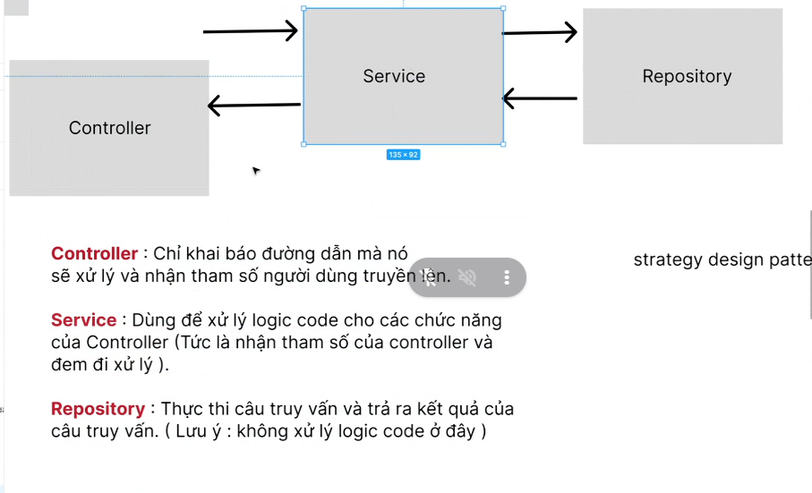

# Buổi 29
Giải btvn hình đầu tiên

để tái sử dụng thì tạo cái RoleEntity

### thêm user - user add
Nghiệp vụ thêm mới thành viên:
- người ta nhập bên html
- select role mình phải lấy bảng role ra
- insert data vào -> bảng user
- thêm người dùng vào bảng user trước hay là lấy role từ bảng role

vscode với inteligi nào code java tốt hơn?
- vscode tốt hơn 1 xí


đây là strategy design pattern

principle architect --> chính là design pattern

code theo thứ tự: 
- Controller -> Repo -> Service
- mình cần xác định 

Về đọc cuốn Clean code

nhớ là cái này trả về tên file, nên bỏ vô trong catch khi bắt lỗi
```java
System.out.println("findAll: "+ e.getLocalizedMessage());
```

file userService


roleRepository -> nơi quản lý tất cả câu truy vấn liên quan tới bảng role
roleService -> logic code xử lý tất cả liên quan tới controller, nên tên class của mình trùng với tên controller

[tải jstl](https://mvnrepository.com/artifact/javax.servlet/jstl)

tải 1.2

[tải 1.2](https://mvnrepository.com/artifact/javax.servlet/jstl/1.2)

jstl để thay cái <% %> 
search từ khóa jstl tutorial -> hướng dẫn nhanh -> search site: tutorials point: nó liệt kê ngôn ngữ từ đầu tới cuối -> học hết thì thông thạo luôn

[jstl tutorials point](https://www.tutorialspoint.com/jsp/jsp_standard_tag_library.htm?fbclid=IwZXh0bgNhZW0CMTEAAR3vn98Cel8jwK20TwVDkrFhD1VJ1r8jLmChfQIAb2RM90JONRsQqzzPWfo_aem_fNk4YSfjQ8sPKMnlbHlflg)

- tải file jar về
- 
để sử dụng jstl mình cần copy thư viện

về cơ bản mình cần, logic nhỏ nên từng này là đủ
-  `c:if`: hiển / ko hiển, logic nhỏ  
-  `c:forEach` 

Attribute: 
- `items`: mảng và mình cần duyệt, mình cần một biến đại diện cho từng phần tử mình duyệt
- `var`: từng phần tử mà mình duyệt cần 1 cái tên

```java
<%@ taglib prefix = "c" uri = "http://java.sun.com/jsp/jstl/core" %>
```

mở `user-add.jsp`
```html
  <select class="form-control form-control-line">
    <c:forEach>
      <option>London</option>
    </c:forEach>
  </select>
```

- logic code xử lý sai khi nào:
  - sai giá trị người ta truyền vô 

lấy danh sách role hiển thị lên, tách theo design pattern
- mình cần truy vấn lấy danh sách role, lúc này controller cần, nhưng controller ko được trực tiếp chạy repo, vậy nên nó gọi qua service, giờ mình chia ra switch case cho nó lấy userAdd
- ListRole 
- nếu như thêm user mà quay lại danh sách nhân viên mà ko có thì mình truyền sai, trong db có mà mình ko có thì mình sai lun

BTVN: 
- làm tính năng thêm nhân viên, 
- bắt buộc phải luyện lại và làm được luôn
bữa sau:
- sửa btvn
- làm phân quyền, filter -> kiến thức quan trọng liên quan tới Spring Boot
- 