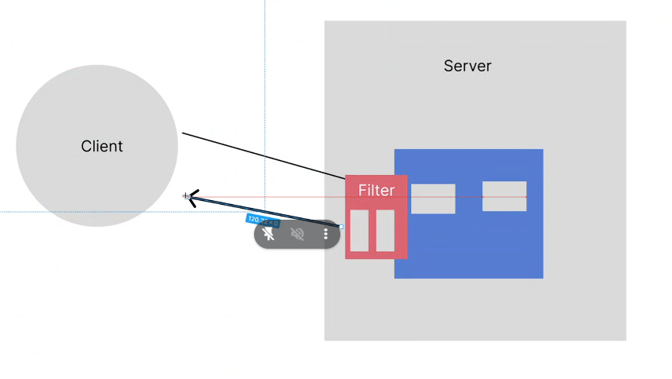

# Buổi 30

sửa btvn, xong buổi sau qua Sprint học

làm sao ép kiểu String về kiểu dữ liệu nguyên thủy int
dùng Interger.parstInt()

Controller sẽ chỉ dùng để định nghĩa đường dẫn và truyền tham số, vậy 

làm sao biết mình insert những trường nào -> coi figma

Insert của mình có 2 loại
- loại này tốn time kinh dị, insert 10k dòng dữ liệu phải xài 10k câu insert
```
INSERT INTO users('fullname') VALUES('');
```
- loại 2 là insert batch, có thể insert 10k dòng dữ liệu nhưng rất nhanh.

Repositoy có duy nhất 1 ý nghĩa là thực hiện câu truy vấn

khi mà test mình chịu khó test happy case trước, cứ điền đúng hết giá trị xong rùi tester có test sửa sau cũng được

## BTVN:
- mở ra tự làm lại mấy cái bài về nhà, hông bật video gì hết search cũng được
- chatgpt cũng được, nhưng ko bật video, miễn tự làm là oki
- nhớ là mình ko nên code theo chatgpt, mình phải tự làm lại

mình chưa xử lý password, nó ra được password hiện cái gì luôn, vậy nên mình cần xử lý cái raw password đi nhen

2 khái niệm về mã hóa:
- mã hóa 1 chiều
- mã hóa 2 chiều

các chuẩn mã hóa password đang xài có các chuẩn sau, đều lầ mã hóa 2 chiều:
- MD5: mã hóa 2 chiều
- base64
- sha1
- hmac
- BScrypt
- RSA: từ md5 mà lên. xịn nhất, bank đang xài
  - sinh ra 2 chìa khóa
  - 1 chìa chuyên giải mã, 1 chìa chuyên mở khóa

mình xài cái gọi là filter để phân quyền:


và code
tạo cái package filter > AuthenticationFilter


mình phải hiểu sâu từ đó mình mới vận dụng được, ko là mình bị rập khuôn

lên senior như nào:
- How? 
- Why? tìm giải pháp giải quyết vấn đề đó, tại sao lại xài thằng này mà ko xài thằng kia thằng nọ, cái dự án đó giúp ích gì cho mình, cho hệ thống của mình mà mình xài nó

giờ làm sao mình xài filter được, mình hiện có cái authentication filter rồi bây giờ sao mình xài:
- khi đăng nhập thành công, lưu tên role vào cookie
- Khi qua filter, lấy đúng cái role đó ra là xong

mình lưu cái tên role hay cái id role vào cookie? tại sao mình ko lưu số?
- vì ko nhớ
- vì sau này người ta đổi role name thì sao, để sau này mình còn mở rộng code
-> nên là xài role fix cứng
- trong csdl của mình có những dữ liệu cố định ko đổi là 3 role cố định: admin, user, data thì gọi là `master data` 

## lần sau nhớ anh Bình sửa bài thì chụp hình code lại 


mở file thêm cái điều kiện ở đây nhé


thêm vô cookie


kiểm tra trong filter


```java
String rolename = "";

```


## btvn:
- buổi sau mình tìm hiểu 2 bài về git: git là gì, các tình hún xảy ra
- nhớ hoàn thiện capstone giữa khóa nhé các bạn, những nào có tiếng việt -> làm hết
- sửa eclipse cho nó hoạt động đc nhen