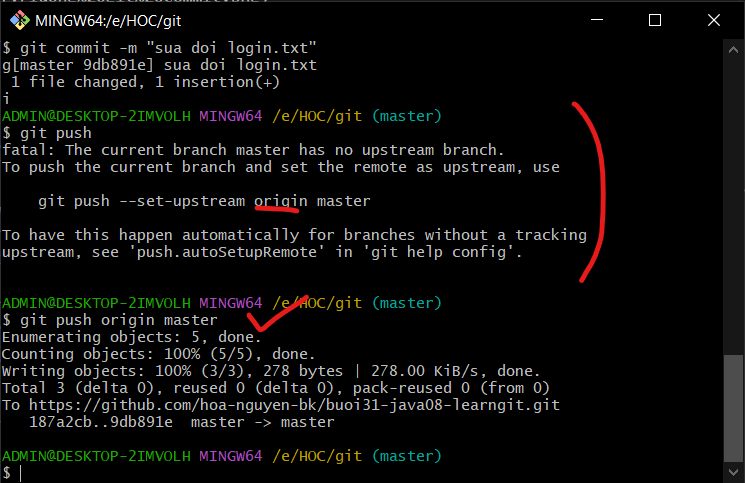

# Buổi 31
## sự khác bịt giữa github và gitlab?
- github 
  - có khi bán luôn source của mình cho bọn tung của, bọn nó chỉ cần copy 1 phát là oki
  - github hông có gì là private mô
  - bị đem code đi train ai
- gitlab
  - open source:
    - ai ai cũng xem được, đều tải về và maybe người giỏi sẽ đóng góp
- hồi xưa có SVN -> xong tới ToitoiseVN
- ứng dụng hỗ trợ git nhanh
  - smart git
  - ide vscode

Chế Công Bình
https://github.com/
https://git-scm.com/downloads
Bước 1 tạo tài khoản github, bước 2 tải cái tool git-scm về

- Các bước Tạo source lần đầu tiên và up lên git
  1. Tạo repo trên server git
  2. Git init: tiến hành khởi tạo git local cho source muốn tương tác
  3. Git remote: liên kết repo local với repo server git
     1. Git remote add origin: chữ origin này đại diện cho server git của mình, Mình đang liên kết với server git bằng chữ origin này, khi server git chứa source báo lỗi, có chữ origin này nó sẽ chỉ cho mình báo lỗi gì
     2. mình ssh có nghĩa là mình hông xài đăng nhập giống http mà xài public và private key để đăng nhập
  4. git status: kiểm tra các file thay đổi
  5. git add: thêm tất cả các file chỉ định vào hàng chờ upload
     1. có 2 thằng add tất cả: 1 là git add *
     2. git add .: add tất cả bao gồm file ẩn
     3. git add *: add tất cả loại trừ file ẩn
        1. queue upload
  6. git commit: ký xác nhận là các file trong 
  7. git push

cách khác để đăng nhập, tạo token
để setup đăng nhập các khác: click zô avatar > setting > developer setting

tạo New personal Access Token classic
- đặt tên
- no expired
- check hết full quyền
- lưu token lại trong sticky note
- zô .git:
  - zô config.git
  - thêm cái token zô cái chỗ này và thêm dấu @

- sau đó push lại và nó bình thường

- khi vô công ty người ta hông khuyến khích xài token mà xài ssh, cái token là dành cho đối tác hoy, còn ssh nó bảo mật hơn nhiều, và dễ lắm yên tâm lên search là bít xài liền

khi chỉnh sửa, up file mới xong ta làm gì?
- git status
- git add *
- git commit -m "câu commit"
- git push

đã xin source anh Bình, tiếp tục làm homework bữa nhen

