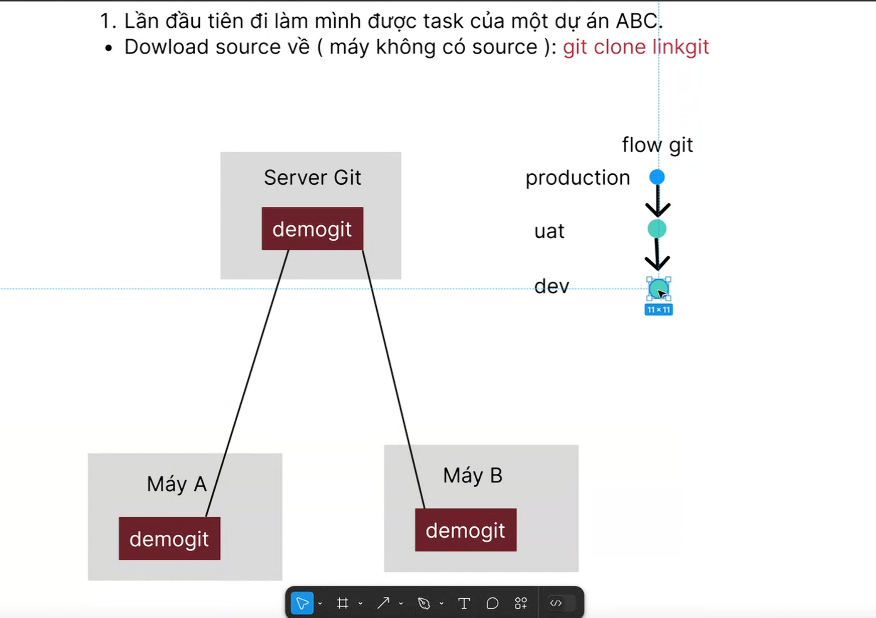
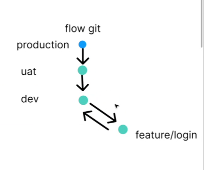
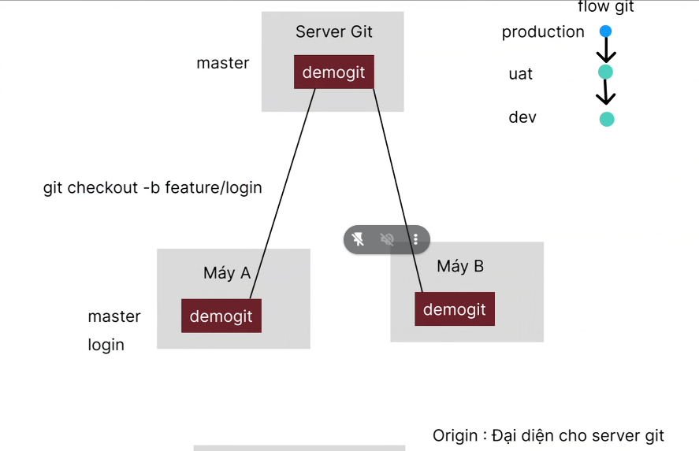
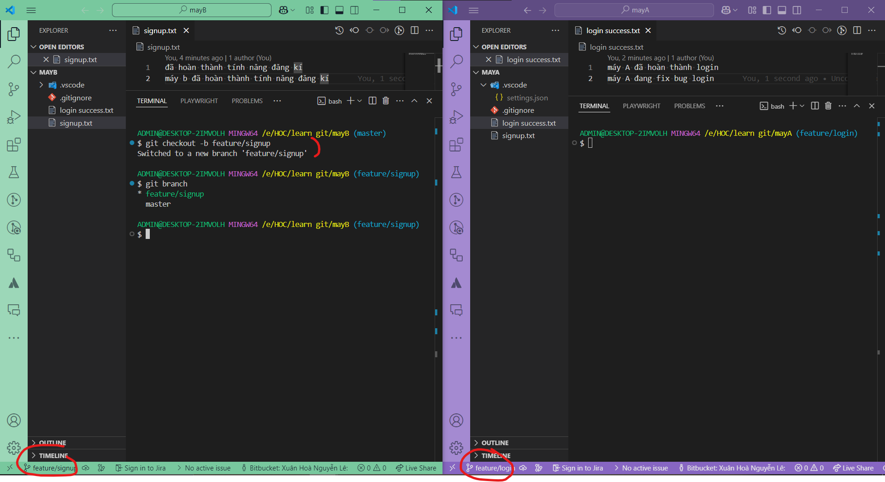
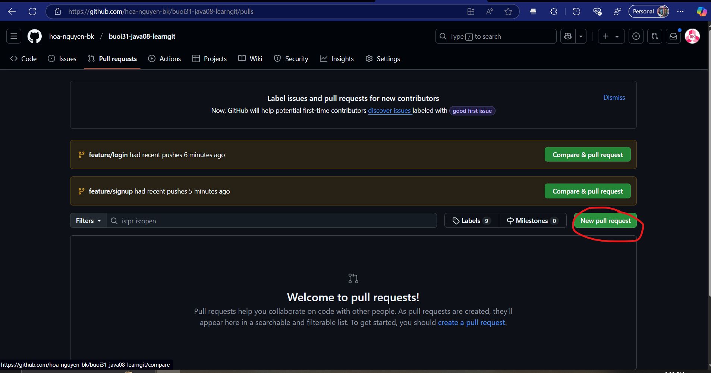
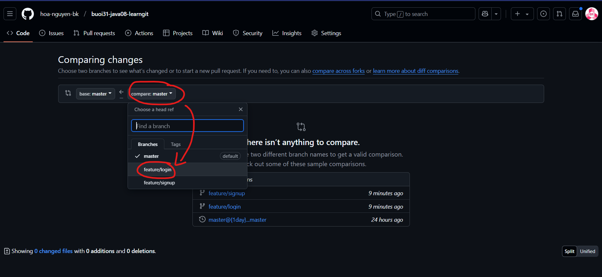
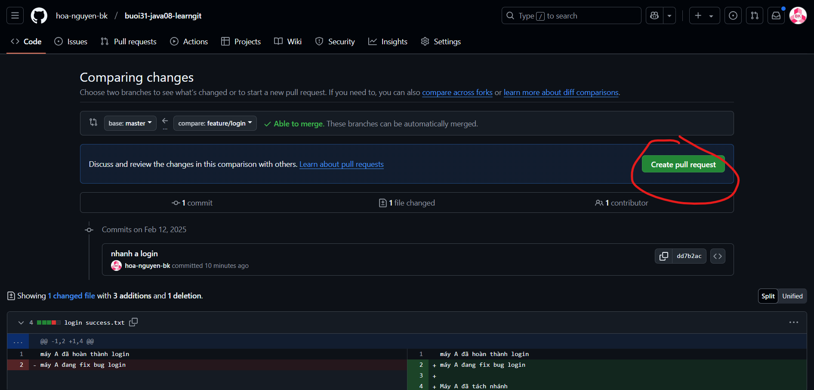
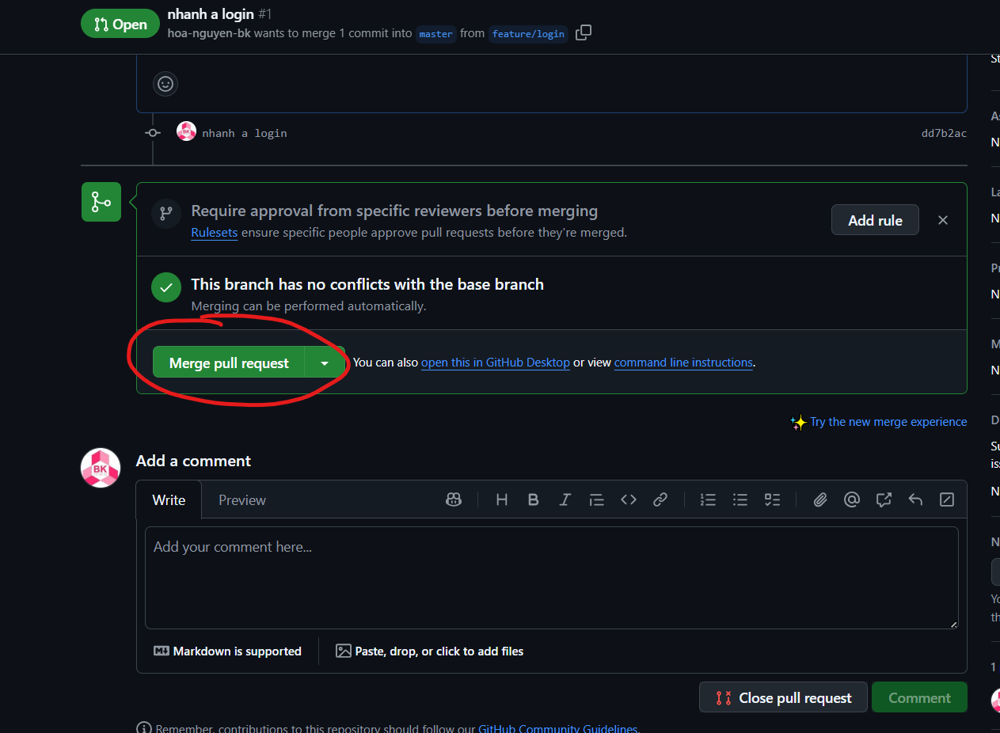

2 trường hợp:
- chưa pull code về đã push
- tách nhánh
  - sau này nhớ hỏi "anh ơi anh có flow git hôn"?
  - 

origin có tác dụng gì:
- kiểm tra trên github có nhánh đó ko
- nếu ko có thì nó tạo lun

me said to team lead: "êm đã tạo pull rì quét rồi"

btvn cho mentor
- bữa sau làm cái file chia nhóm 