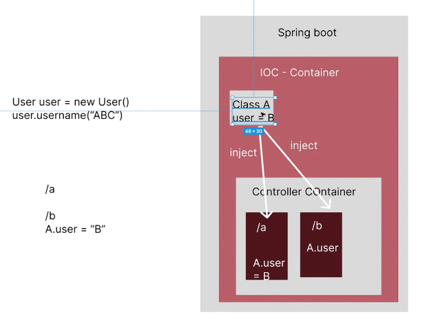

# Buổi 33
Struct -> Spring MVC -> Spring Boot
Spring MVC setup cực cực dã man luôn á, mà nó là trước Spring boot, học Spring Boot xong rồi tìm hiểu Spring MVC sau, cứ xong hết 1 thằng rồi mới đi thằng khác chứ đừng tìm hiểu song song nhé

- mở slide Spring-framework: 
  - Slide trang số 7:
    -  để tìm hiểu hoàn chỉnh là cần 5 layer 
    -  về mặc design pattern 
    -  hồi xưa ai xài wordpress dễ bị hack dã man luôn nên nó đã sắm cục security zô mới được
 - Slide số 8:  Spring boot cấu hình sẵn còn lại do mình tự làm hết
 - Spring Ecosystem
   - nguyên hệ sinh thái spring có rất nhiều thằng, phần bên tay phải mình học hết 80% về nó
   - Spring AOP
   - Spring web
   - Spring test có công ty cần công ty ko, nên anh loại ra luôn
   - Spring data
   - Spring messaging
   - qua phải nữa
   - Spring LDAP: khi học ở trường nó sẽ cung cấp hệ thống local, mà cũng có công ty cần có công ty ko, nó thuộc về mảng của devops
   - Spring AMQP
   - phần bên phải chia tay bỏ cút nhoen
   - về cơ bản ra ngoài làm sẽ nhiều hơn
   - chừng này là 30% kiến thức mình đi làm hoy
 - Tại sao chọn spring boot?
   - Admin Features:
     - Phân quyền
     - 
   - Security là có:
   - Logging:
     - fix bug
     - chửi lộn, đi chửi lộn với third party
       - bằng chứng nào chứng minh mình đã nhận thành công, lưu vào csdl
       - giả sử mình gửi hệ thống thứ 3, mình cập nhập hệ thống thành công
       - mình ghi nhận mình gửi cho họ cái gì, và mình nhận lại của họ cái gì
     - trade lịch sử
       - ghi lại lịch sử dữ liệu tại vì nó ghi thành file ghi lịch sử ổ đĩa
       - ghi lại lịch sử mình gửi khách hàng như nào và nhận từ khách hàng như nào
   - Caching
     - mình sẽ học 1 hệ thống bảo trợ caching là 
   - Validation
   - JSON
   - Testing
   - Task Execution and Scheduling
     - dịch vụ đoạn code là đúng 12h đêm đoạn đó đó mới chạy, hoặc 5' chạy 1 lần
     - chức năng ví dụ: tự động nhắn tin vs cờ rút
 - Spring Boot sẽ giúp nó làm dễ hơn bằng tay, và nó ngon và mạnh bằng dụ security

- Khởi tạo dự án Spring:
  - https://start.spring.io/ zô đây
    - Project: có mục Gradle và Maven
      - là 2 cái quản lý project, nó tự động dowload và cấu hình cho mình luôn, nó giúp cho mình quản lý tập trung
      - 2 thằng này tuy khác nhau về mặt syntax nhưng ý nghĩa sử dụng giống nhau 100%
      - Gradle build nhanh hơn mà maven build chậm hơn
        - Grandle sẽ cache nhiều hơn
          - lúc thì cái cache nó còn hoạt động nó chạy, lúc cache hông chạy
          - lúc cache cũ còn thì nó bị lỗi, nên lúc project nó chạy, lúc project nó hông chạy 
        - Maven cache ít hơn
          - đỡ bị zụ nói trên
    - Language: chọn ngay Java đừng có chọn Kotlin
    - Spring Boot:
      - đừng bao giờ chọn mấy cái mở ngoặc, có khi nó dành cho 1 cái gì đó đặc biệt á
      - chọn bản 3.4.2
    - Project Metadata:
      - Group và Artifact: mình biến source code mình thành thư viện được luôn, thằng nào mún xài chỉ cần điền đúng cái này là được
      - Group thường là tên công ty ha
      - Package name: ko chạm vô
    - Packaging:
      - Chọn như nhau thôi ko khác gì, giống nhau y chang: Jar
    - Java: chọn ngay cái 21, đừng chọn 23 vì mới quá


- Setup Dependencies:
  - Spring Web

  - open in inteligi

  - cái package name ko được phép xóa, ko được phép đổi luôn, nó là giữ nguyên, là main package, xóa là liệm
  - Resources:
    - static: bỏ những file hco phép người ta dowload hình ảnh đồ nè
      - thường làm spring boot là bỏ nên hông cần quan tâm, ko cần care
    - template:
      - nơi chứa file html only
    - application.properties
      - siêu quan trọng, mất là ko chạy lun
      - có application.properties hoặc là application.yaml 1
      - thư viện nó đang xài ứng với thư viện nào
  - file Pom.xml:
    - coi thử đi nó có tới 33 thư viện
    - này là file tinh chỉnh cấu hình project
    - đổi version spring boot, version thư viện nó nằm trong file pom này
  - mặc dù nó y chang servlet nhưng nó có chức năng định nghĩa đường dẫn và khai báo tham số liên quan đến đường dẫn
  - còn làm sao truy vấn cơ sở dữ liệu là do các thư viện hỗ trợ


- Controller Container:
  - định nghĩa annotation là 2 cái @Controller và @RestController
  - `@Controller`: 
    - dùng để xử lý đường dẫn
    - đường dẫn đó phải có giao diện, phải có file HTML
  - `@ResponseBody`: đường dẫn chỉ trả ra chuỗi
  - `@RestController`: 
    - hông cần phải có file HTMl
    - Đường dẫn phải trả về 1 chuỗi
  - khi mà thấy 2 cái này nó sẽ tự động add controller 
  - `@RequestMapping` giúp định nghĩa đường dẫn

```java
package com.cybersoft.demo_buoi33.controller;

import org.springframework.web.bind.annotation.RequestMapping;
import org.springframework.web.bind.annotation.RequestMethod;
import org.springframework.web.bind.annotation.RestController;
//  @Re xong cái nó tự gợi ý
@RestController
public class DemoController {
    @RequestMapping(path = "/demo", method = RequestMethod.GET)
    public String demo(){

    }
}
```

tÍp theo ở dưới mình thêm cái nữa
```java
package com.cybersoft.demo_buoi33.controller;

import org.springframework.web.bind.annotation.RequestMapping;
import org.springframework.web.bind.annotation.RequestMethod;
import org.springframework.web.bind.annotation.RestController;
//  @Re
@RestController
public class DemoController {
    @RequestMapping(path = "/demo", method = RequestMethod.GET)
    public String demo(){
        return "Hello World";
    }
    
    
    public String hello(){
        return "Hello BC08";
    }
}

```
- mình sẽ thêm cái dường dẫn bằng cách thêm RequestMapping
- với đường dân


bạn nào nó hiển thị thông báo cài này cài kia hay hiển thị góc phải dưới màn hình, mà bạn lỡ tắt, thì bạn dùng nút này nhen mí bạn

Nếu bạn nào mà khai báo class cùng cấp hoặc con của cái ...Application

@ComponentScan: dùng để nếu bạn có cái class nằm ngoài package nào, thì chỉ định zô cái class đó, thì nó mới quét được file đó và đọc thằng đó, nếu ko là nó lỗi

- cái slide dependency intrention - DI DC: 
  - phỏng vấn hay bị hỏi lắm nha
  - giảm sự phụ thuộc của class
  - tóm lại trong 1 chữ, singleton
  - cách thức
  - ý nghĩa
  - nó giống cái static đó
  - Project của mình có rất nhiều controller, mình muốn sử dụng các biến giữa thằng này và thằng kia, vậy nên mình muốn thằng nào mún xài đoạn code đó thì mình gọi thằng đó là xong

  - mình có 1 class, mình đã gán sẵn giá trị, mình mún cho controller hay class khác sử dụng giá trị class đó
  - ví dụ a tạo 1 user: `User user = new User()`
  - anh mún gán `user.username = "ABC"`

  - thằng IOC là thằng quản lý các class đã tạo sẵn giá trị như là user.username mình gán cho nó bằng ABC
  - 
  - ví dụ mình có nhìu controller mà nhiều controller mún sử dụng giá trị này thì mình inject zô
  - 
  - : khó nắm nhen phải coi lại video 11:04 phút
  - khi mà gọi A.user nó vẫn gọi ra chữ B
  - khi nào server sập thì nó gán lại giá trị cho mình
  - Khái niệm `Dependency Injection`: là mình có 1 class mình khởi tạo sẵn giá trị, khi các class khác mún xài thì mình chỉ cần gọi class nó xuống và sử dụng 

- file application.properties
```properties
spring.application.name=demo_buoi33
server.port=9090
```

2 cách để tạo 1 class và đưa lên IOC
- Cách 1: khởi tạo class và giá trị mặc định cho các thuộc tính của class đó, rồi đưa lên IOC lên lưu trữ, sau này ai mún xài thì xài
  - Cách này có annotation tương ứng tên là `@Bean`
  - Bean này có giống Java Bean không anh? -> Java Bean chính là nó, nó là 1
- Cách 2: đưa class đó lên lun, class đó chưa khởi tạo gì hết, cứ thế đưa lên IOC luôn, ai mún khởi tạo gì thì khởi tạo, xài gì thì xài
  - Có annotation tương ứng là `@Component`, `@Service`, `@Repository`,... nhìu lắm
- ở ngoài người ta xài 2 cách lun nhưng cách thứ 2 thì nhiều nhất. 
- ví dụ cho cái trên lun:
- tạo package entity
  - tạo class Nhân viên trong nớ
  -  chuột trái
  - 
  - class này mình khởi tạo và gán giá trị thuộc tính, nó cần khởi tạo trước khi nó gán giá trị thuộc tính
  - 
  - trước khi tất cả class chạy lên thì có thằng @Configuration chạy trước
    - Trong Application: Đầu tiên nó quét thằng cùng cấp Configuration trước xong tới @Controller
    - Giờ a mún chạy cái gì đó trước @Controller thì nó chạy vô mấy @Configuration, trong Spring boot có sơ đồ quét thằng nào chạy đầu tiên lun, nó có cái hình đó đó --> btvn
    - tạo package config -> class NhanVienConfig -> thêm @Configuration
```
package com.cybersoft.demo_buoi33.config;

import org.springframework.context.annotation.Bean;
import org.springframework.context.annotation.Configuration;

@Configuration
public class NhanVienConfig {
    // Khai baso class gán sẵn giá trị và đưa lên IDC lưu trữ
    @Bean
}

```
  - khoan hắn demo cái dưới đây
```
package com.cybersoft.demo_buoi33.config;

import com.cybersoft.demo_buoi33.entity.NhanVien;
import org.springframework.context.annotation.Bean;
import org.springframework.context.annotation.Configuration;

@Configuration
public class NhanVienConfig {
    @Bean("a")
    
    public NhanVien setNhanVien(){
        NhanVien nhanVien = new NhanVien();
        nhanVien.setUsername("Nguyen Van A");

        return nhanVien;
    }

    @Bean("b")
    public NhanVien setNhanVien1(){
        NhanVien nhanVien = new NhanVien();
        nhanVien.setUsername("Nguyen Van B");

        return nhanVien;
    }
}
```
  - chỉ cần coi trước cái này
```
package com.cybersoft.demo_buoi33.config;

import com.cybersoft.demo_buoi33.entity.NhanVien;
import org.springframework.context.annotation.Bean;
import org.springframework.context.annotation.Configuration;

@Configuration
public class NhanVienConfig {
    @Bean
    public NhanVien setNhanVien(){
        NhanVien nhanVien = new NhanVien();
        nhanVien.setUsername("Nguyen Van A");

        return nhanVien;
    }

}
```
  - Trong UserController
```java
@RestController
@RequestMapping("/user")
public class UserController {
    // lấy đối tượng đã lưu trữ trên IOC xún sử dụng
    @Autowired // nó sẽ chui lên IOC này tìm xem có class nào có kiểu dữ liệu là Nhân viên ko, nó thấy đúng 1 giá trị thì nó gán cho biến nhanVien này, đây là kiểu dữ liệu tham chiếu
    private NhanVien nhanVien;

    @GetMapping
    public String getUser(){
        return "Get user";
    }
    @GetMapping("/add")
    public String addUser()    {
        return "Add user";
    }
    @GetMapping("/update")
    public String updateUser(){
        return "Update user";
    }


}
```
  - rùi thêm cái get username vô trong
```java
package com.cybersoft.demo_buoi33.config;

import com.cybersoft.demo_buoi33.entity.NhanVien;
import org.springframework.context.annotation.Bean;
import org.springframework.context.annotation.Configuration;

@Configuration
public class NhanVienConfig {
    @Bean
    public NhanVien setNhanVien(){
        NhanVien nhanVien = new NhanVien();
        nhanVien.setUsername("Nguyen Van A");

        return nhanVien;
    }


    public NhanVien setNhanVien1(){
        NhanVien nhanVien = new NhanVien();
        nhanVien.setUsername("Nguyen Van B");

        return nhanVien;
    }

}

```
  - setNhanVien1 ko đặt annotation bean nên nó ko chạy
- Bữa nay xong phần spring boot
    - khai báo đường dẫn định nghĩa tham số, kết thúc spring boot là 50%, thêm bean là thêm 20%
- Bữa sau 
  - cách truyền tham số
  - 100% hoàn thành spring boot
- Bữa sau nữa:
  - Thư viện spring boot, call api  

### BTVN: 
- Tham khảo thêm: Pro M4 gb 24gb nha, 
- Về nhà tìm hiểu -> tìm hiểu từ Framework Spring Boot:
  - Webflux (Reactive): cách code cách sử dụng y chang spring boot nhưng khác nhau cách cấu trúc, cách vận hành, cách thức hoạt động, khái niệm logic y chang luôn
  - Vertx
- Spring test
- Về xem video dependency intrention - DI DC của Tôi đi code dạo


