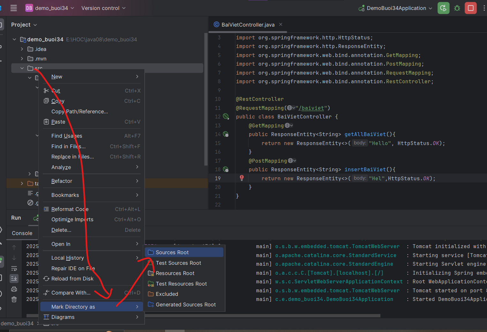

- bean là class khởi tạo giá trị sẵn và đưa lên ioc lưu trữ, nào cần thì lấy từ bean về
- dependency injection giải thích giống bean zị đó
- khi mà biến A có trên bean, class B gọi tới A thay đổi, thì class C gọi tới A a đã thay đổi rồi

- channel: ứng dụng chạy trên web, ứng dụng chạy trên mobile, trong khi đáng lý ra mình gọi là flatform mới đúng


- mọi thứ đều trả về kiểu string


- Thường mobile mắc hơn web 1.5 nha, cái gì cũng gọi tới database

- database thì nó cần public thì nó mới gọi được từ mobile và desktop, mobile là mạng internet nên database 
- zị nên ngừi ta hông cho phép mobile và desktop app truy cập trực tiếp vào database, database ko được phép public, các tính năng của mình ko phát triển lại và thứ 3 nó phải hỗ trợ cho toàn bộ ngôn ngữ.

- cần có 1 thằng đóng vai trò trung gian, xử lý code từ database, và đưa cho toàn bộ ngôn ngữ khác được.

- dữ liệu kiểu string trả ra toàn bộ ngôn ngữ khác đều đọc được thì toàn bộ ngôn ngữ khác mới đọc được

- chuẩn dữ liệu string là chuẩn xml, kiểu thứ 2 là json

- hồi xưa nó có soap -> xml, giờ thấy json dễ hơn nên người ta trả về json hết, có 2 loại json:
  - json array []: một mảng kiểu dữ liệu mong mún

```json
[1,2,3]
```
```json
[
  {
    "key": "value"
},{
    "key": "value"
},{
    "key": "value"
}
]
```


  - json object {}: một đối tượng, được kí hiệu bởi dấu ngoặc nhọn: 

```json
{
    "key": "value"
}
```
kiểu dữ liệu nguyên thủy, kiểu dữ liệu tham chiếu
- cái khó nhất là trình bày json sao cho front-end dễ xử lý và xử lý tối ưu.


coi slide 
```
REST tuân thủ 4 nguyên tắc thiết kế cơ bản sau:
 - Sử dụng các phương thức HTTP một cách rõ ràng.
 - Phi trạng thái.
 - Hiển thị cấu trúc thư mục như các Urls.
 - Truyền tải JavaScript Object Notation (JSON), XML hoặc cả hai
```
1. stateless là phi trạng thái và chính lý do tại sao nó xài 

2. thread, 4 luồng mà kẹt cả 4 vì nó chiếm hết luồng á
các trang web servlet mình làm thì tới thời điểm nào đó cái luồng băng thông của mình nó sẽ hết. Thằng restful api nó có 1 cái khắc phục là khi lấy được dữ liệu thì nó ngắt kết nối và giải phóng luồng backend của mình luôn
- đã là phi trạng thái thì ko có khái niệm session
3. url 
4. trường hợp cãi lộn, khách hàng báo bug, front-end ko check mà kêu back-end check: 
   1. be sẽ ko biết lỗi tính năng nào để check
   2. theo nguyên tắc, front-end check trước để xem phải bug chỗ nó ko -> xong tới back-end check bug
5. 1 đường dẫn mà định nghĩa 4 phương thức thêm xóa sửa:
   1. Get: lấy dữ liệu về
      1. 200 oki
      2. 404 not found
      3. 400 bad request
   2. Post: insert dữ liệu
      1. 201 created
      2. thường auto post hết do dữ liệu gửi lớn, ko thể dùng post được, còn post thì có thể mã hóa được data truyền lên
   3. Put: cập nhập dữ liệu
      1. 200 oki
   4. Delete: xóa dữ liệu
      1. 200 oki
- status code thì nhớ nhưng ko cần học thuộc

- giữa rest api và restful api thì khác nhau chỗ nào?
  - restful kế thừa rest api và có get, post put delete và status code

## Thực hành


khởi tạo 

lỗi anh Sáng gặp, bị cái Inteligi hông chịu nhận diện được, ko tạo được package



```java
package com.example.demo_buoi34.controller;

import org.springframework.http.HttpStatus;
import org.springframework.http.ResponseEntity;
import org.springframework.web.bind.annotation.GetMapping;
import org.springframework.web.bind.annotation.RequestMapping;
import org.springframework.web.bind.annotation.RestController;

@RestController
@RequestMapping("/baiviet")
public class BaiVietController {
    @GetMapping
    public ResponseEntity<String> getAllBaiViet(){
        return new ResponseEntity<>("Hello", HttpStatus.OK);
    }
}
```


api stress test Jmeter


httrack down hết tất cả trang

- Bữa sau:
  - đo performance độ phức tạp thuật toán mà ko dựa vào máy tính local, anh Bình sẽ chỉ cho mí bạn vào sớm 30'
  - 