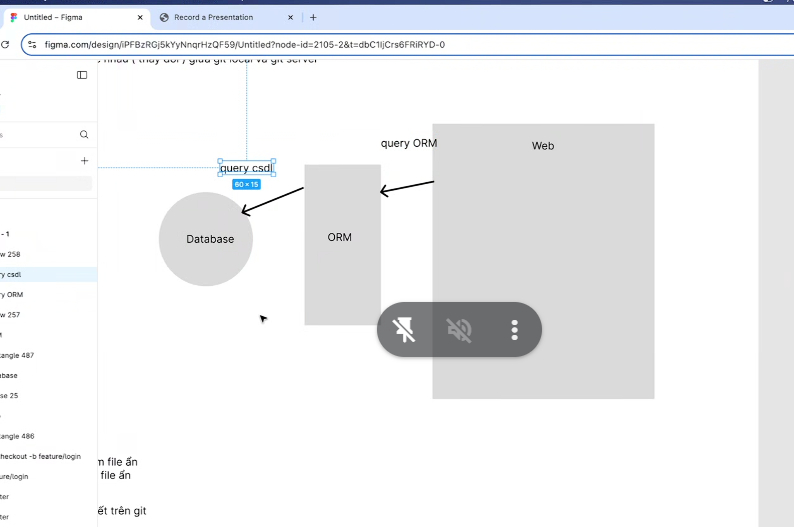
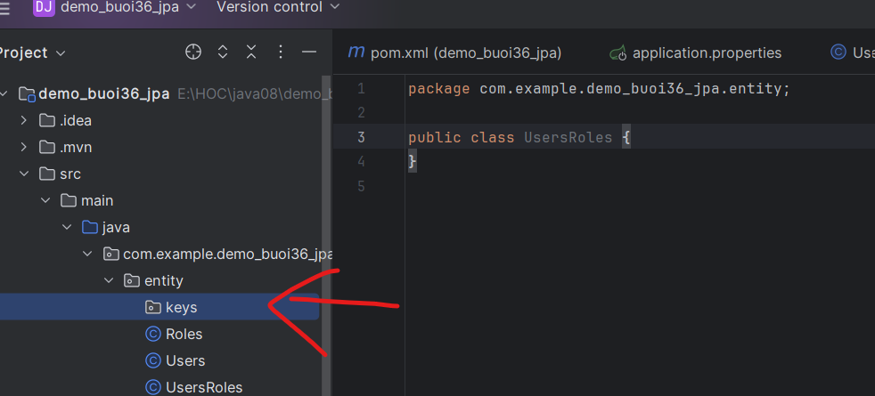

## buổi 36


cục web đang mở kết nối csdl về oracle, tất cả câu truy vấn phải hỗ trợ oracle, giả dụ mình migrate xong hết rùi xong cty ko đủ xiền duy trì oracle mà dùng postgres sql
bây giờ người ta mún xài hệ qtcsl nào cũng đc, nhưng khi đổi 1 cái thì nó tự động chạy đc hết, ko cần phải test 

CÁI THƯ viện trung gian này sẽ giúp mình chuyển đổi csdl qua câu truy vấn, xong bây giờ nó biến đổi câu truy vấn về csdl của oracle, 

Thư viện này có tên gọi là ORM (cái gì đó mapping quên rùi), cái thư viện này giúp mình trung gian viết 1 câu truy vấn xong tự động chuyển qua bất kì csdl nào mà bên dưới đang xài

câu truy vấn nó viết 


Zô file figma để học
https://www.figma.com/design/iPFBzRGj5kYyNnqrHzQF59/Untitled?node-id=0-1&p=f&t=hUjqcWjl3PkjktxX-0

JPA người ta xài nhìu hơn microtich
hồi xưa lúc chưa có spring boot người ta xài hibernate, xong nó viết câu truy vấn khó khăn và khó hiểu, nên cái JPA phát triển từ hibernate lên 

cái jpa này mình ko cần quan tâm, ko cần biết script biết gì thì nó đều viết cho mình lun

các class đại diện cho cái bảng được gọi là entity, lúc này mình ko cần bít viết script cơ dữ liệu, mình chỉ cần định nghĩa thuộc tính thì nó tự động tạo bảng cho mình, cái này viết để phục vụ front-end chứ hông phải back-end

lúc mà thíu be, fe chỉ cần dùng thư viện orm này hỗ trợ quan hệ vz csdl, nào nó có quan hệ vz nhau thì nó tự động kết nối lun nếu mình tự động viết đúng

có 2 khái niệm:
- code first: viết code trước xong nó tự chạy sql
- database first: những lệnh tạo bảng mình viết script csdl để tạo bảng: mở kết nối viết câu truy vấn, viết viết viết, xong rồi lên connect hoy

Nhưng orm thì có nhược điểm:
- ko tối ưu câu query phức tạp, mình viết lặp giới hạn số lượng dòng á, phép tích á
-> nặng tốn tài nguyên
- quên hết câu sql lun
 


```

Tech stack: 

Db: postgres

Framwork: spring 3 (jpa, servlet(cổ điển),
 webfux (khi không cần apply persistence data)),
 open-api [swagger: url, define description method authen]

Message queue: kafka, kafka-ui

khúc dưới ni ko học
Monitoring: grafana, promethues

Audit: audit log(datadog), behavior(libarry java (anotation + aop → kafka message → audit service))

Authen, Author: *keycloack, wso2IS*

Source-controll: Pipeline(CI/CD) → git tag → release, argocd-application(monitor container)

ETL: extract transform load → spring batch, quart (reconsiision) (report: python + spark)
```

típ tục => chạy cái mới tải => thì nó lỗi lun
```
***************************
APPLICATION FAILED TO START
***************************

Description:

Failed to configure a DataSource: 'url' attribute is not specified and no embedded datasource could be configured.

Reason: Failed to determine a suitable driver class


Action:

Consider the following:
	If you want an embedded database (H2, HSQL or Derby), please put it on the classpath.
	If you have database settings to be loaded from a particular profile you may need to activate it (no profiles are currently active).


Process finished with exit code 1
```

nó đang méo kết nối đc db,

khai báo cái url thui chứ có j đâu

```properties
spring.application.name=demo_buoi36_jpa
spring.datasource.url=jdbc:mysql://localhost:3306/bookshop
spring.datasource.username=root
spring.datasource.password=password
```

```
2025-02-26T19:38:44.622+07:00  INFO 20288 --- [demo_buoi36_jpa] [           main] org.hibernate.orm.connections.pooling    : HHH10001005: Database info:
  Database JDBC URL [Connecting through datasource 'HikariDataSource (HikariPool-1)']
  Database driver: undefined/unknown
  Database version: 9.1
  Autocommit mode: undefined/unknown
  Isolation level: undefined/unknown
  Minimum pool size: undefined/unknown
  Maximum pool size: undefined/unknown

```
pool size giống cái luồng á

```properties
spring.datasource.url=jdbc:mysql://localhost:3307/java08_buoi36
spring.datasource.username=root
spring.datasource.password=admin123
```
viết vào application.properties

gõ chữ ddlauto vô trong file này xong nó nhắc lệnh cho mình


nó hỗ trợ update, create, none, ... hỗ trợ mình theo trường phái db first hay code first

nếu theo db first thì để là none, lúc này nó sẽ ko tự động tạo bảng cho mình lun, nó chỉ hỗ trợ ánh xạ mình lun,

còn nếu mình xài code first thì chọn lựa chọn còn lại:

tạo package entity


thực ra annotation table mới là cái table trong db

```java
package com.example.demo_buoi36_jpa.entity;

import jakarta.persistence.Entity;
import jakarta.persistence.Id; // nhớ phải là jakarta persistance

@Entity(name = "users")
public class Users {
    @Id
}
```

```java
   package com.example.demo_buoi36_jpa.entity;

    import jakarta.persistence.Entity;
    import jakarta.persistence.GeneratedValue;
    import jakarta.persistence.GenerationType;
    import jakarta.persistence.Id;

    @Entity(name = "users")
    public class Users {
        @Id
        @GeneratedValue(strategy = GenerationType.IDENTITY)
        private int id;

        private String username;
        private String password;

    }
```

mở dbeaver
```sql
CREATE DATABASE java08_buoi36;

USE java08_buoi36;
CREATE TABLE roles (
	id int auto_increment,
	name varchar(50),
	primary key(id)
);

CREATE TABLE users_role(
	roles_id int,
	users_id int,
	primary key(roles_id,users_id)
);
ALTER TABLE users_role ADD CONSTRAINT FK_USERS_ID_USERS_ROLE FOREIGN KEY(users_id)
REFERENCES users(id);
ALTER TABLE users_role ADD CONSTRAINT FK_USERS_ID_USERS_ROLE FOREIGN KEY(users_id)
REFERENCES users(id);
```

Có bao nhiu loại mqh: 4 loại
- 1:1 1 dòng dữ liệu bảng a chỉ lấy đc 1 dòng data bảng b và ngược lại
- 1:n 
- n:1
- n:n
trong jpa thì chỉ có 1:1 và 1:n thui chứ ko có j hơn




class co nhìu khóa chính đặt zô đây
https://www.baeldung.com/jpa-composite-primary-keys?fbclid=IwZXh0bgNhZW0CMTEAAR0HTG-ZmUrm3ra19P1OgZhhG160qOfzG_SdvGnTmGWe3TBC0w6jwSZMurg_aem_WKuXBWtR4fyR31WOw7fTGw


băm binary

```java
@Embeddable
public class UsersRolesId implements Serializable {
    @Column(name = "roles_id")
    private int rolesId;

    @Column(name = "users_id")
    private int usersId;

    public UsersRolesId(int rolesId,int usersId){
        this.rolesId=rolesId;
        this.usersId=usersId;
    }
    public UsersRolesId(){}

```

```java
public class UsersRoles {
    @EmbeddedId
    private UsersRolesId id;
}

```

bảng nào giữ khóa ngoại mới ánh xạ quan hệ

Bảng nào giữ khóa ngoại thì sẽ là @many to one và @JoinColumn và tên khóa ngoại mà mình mún liên kết

entity được tham chíu khóa ngoại phải map ngược lại @OneToMany

list thì ko sao mà set thì ko đc trùng giá trị