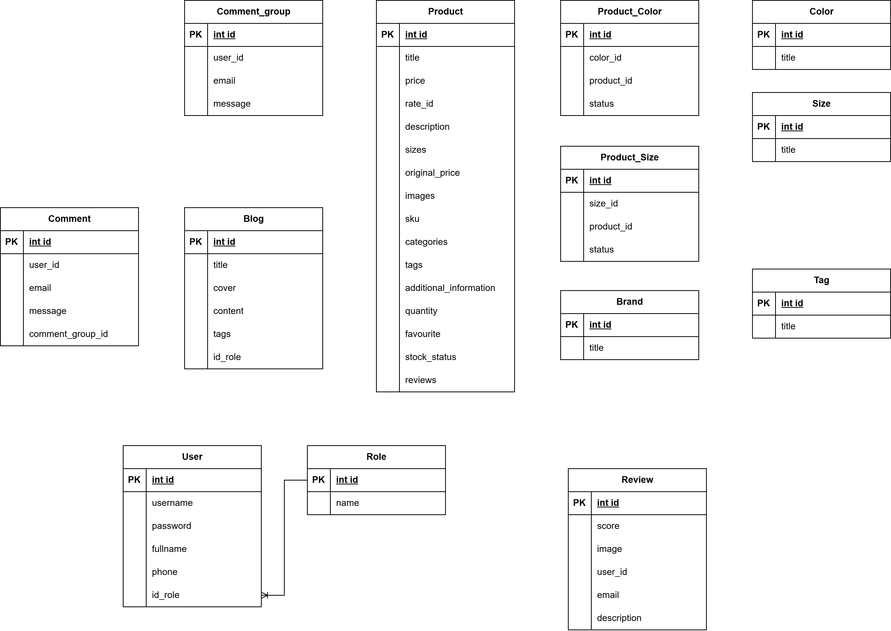
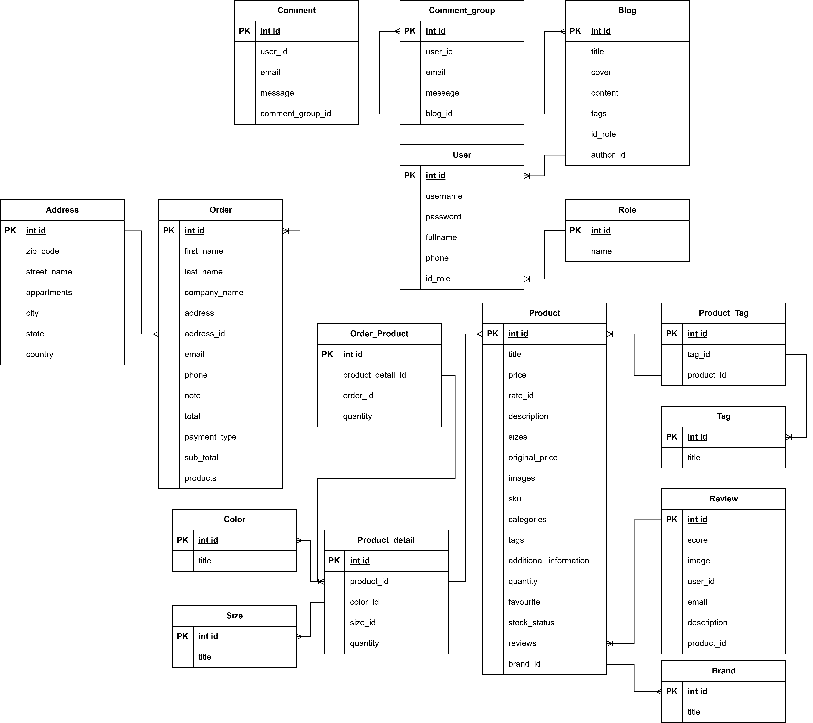

ròi mấy bạn có 1 tiếng rưỡi để phân tích cái source uniclub này, đến 8h15 anh Bình sẽ sửa, dùng draw io để vẽ (sau này mấy bạn cũng xài tool này á), vẽ khóa chính khóa ngoại luôn

uniclub

về nhà tìm hiểu:
- single sign on
- requirement password của bank
  - độ dài 8 kí tự
  - 1 kí tự đặc biệt, 1 hoa, 1 thường
  - ko trùng 5 pass cũ

lưu ảnh dạng array json
```json
{
  "image": ["a1.jpg", "a2.jpg"]
}
```
xong split bên java

hai cột hay nhiều cột đóng vai trò khóa chính
cho 3 cột đó đều unique


buổi chủ nhật làm sql cho mấy cái bảng luôn

cuối buổi, xin requirement doc về mật khẩu, hứa là mình sẽ làm phần đó

xin ảnh giới thiệu flat table và history

 