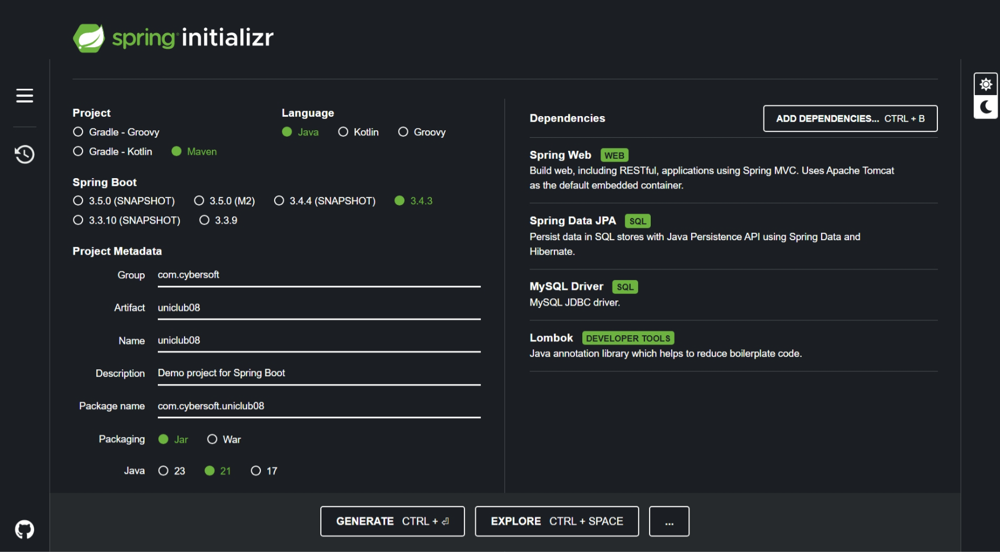
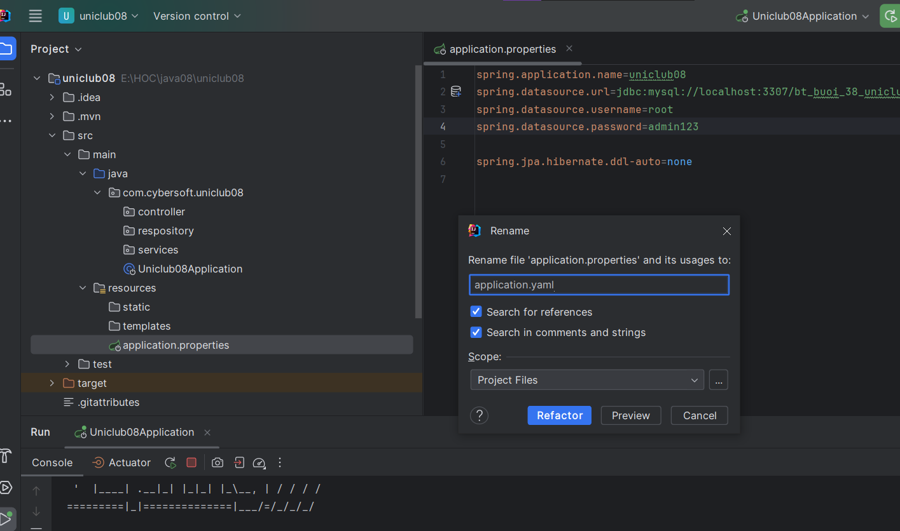
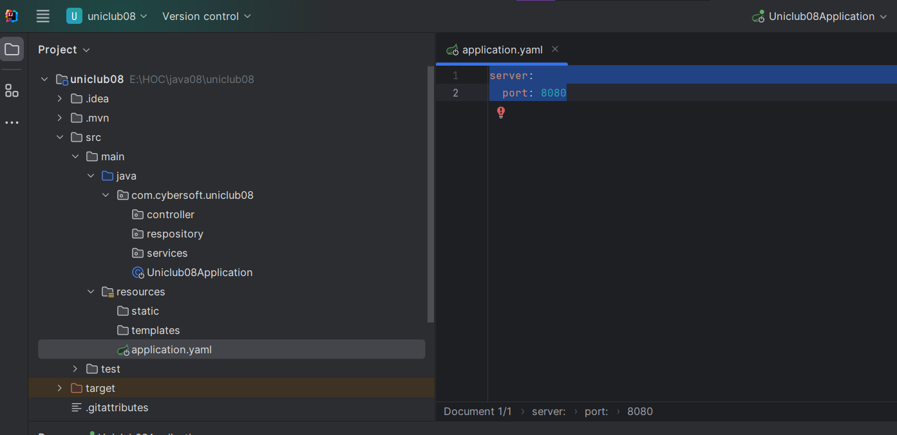
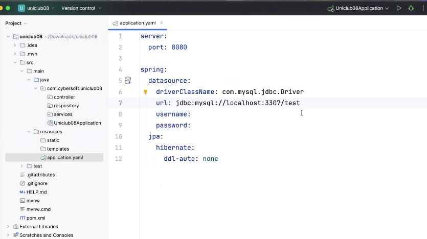
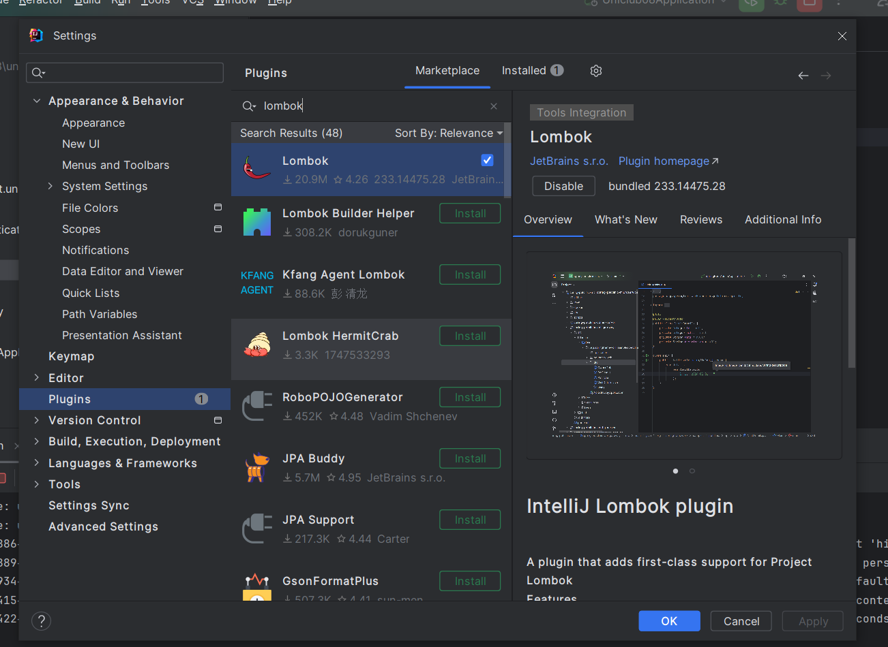
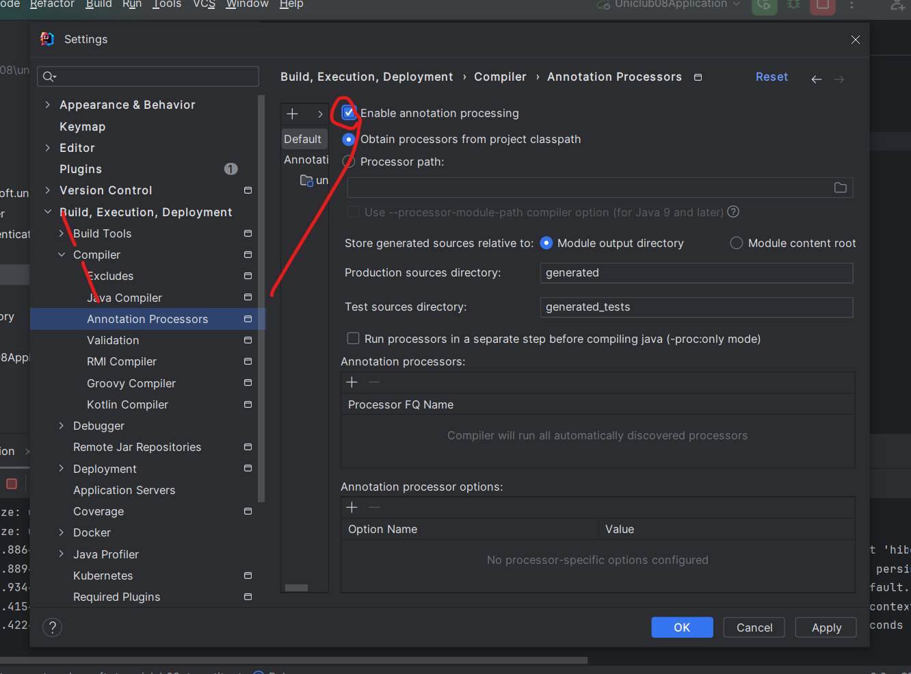
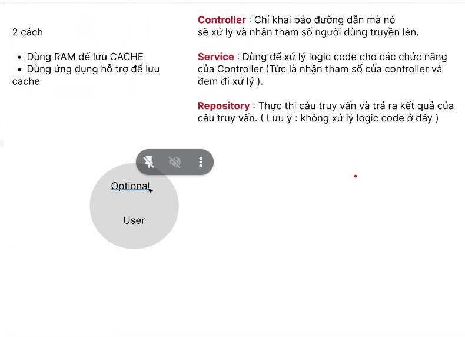

note bài của mình:
- erd mới biết được lịch bác sĩ chưa biết bác sĩ ở phòng khám nào
- mối quan hệ doctor với clinic sẽ bị vòng lặp vô tận
- cần nắm vững lý thuyết, để biết mình giải quyết vấn đề gì, những cái mình đã học thằng nào giúp mình giải quyết được vấn đề đó

logic đăng nhập là gì?

biểu thức :: là gọi đến hàm static



- lombok có ghi dev tool để hỗ trợ toll cho dev

dựng source thì tạo design pattern lun



xài port 8080



đỏi tên yaml

```yaml
spring:
  datasource:
    url: jdbc:mysql://localhost:3307/uniclub
    username: root
    password: admin123
  jpa:
    hibernate:
      ddl-auto: none
```

trong `AuthenticationController`.java 
```java
@RestController
@RequestMapping("/auth")
public class AuthenticationController {
    @PostMapping("/sign-in")
    public ResponseEntity<?> signIn(@RequestParam String email, @RequestParam String password){
        
        return ResponseEntity.ok().build();
    }
}
```


làm cái này trước
```java
@Entity(name="User")
public class User {
    @Id
    @GeneratedValue(strategy = GenerationType.IDENTITY)
    private int id;

    private String username;
    private String password;
    private String fullname;
    private String phone;

}
```

2 cách 1 là map lun hay 2 map sau

thằng này giữ khóa ngoại sẽ là many to one và join column





### 3. **Dùng Live Server của VS Code (mở trình duyệt)**  
Nếu muốn dùng Live Server nhưng chỉ chạy trong terminal, có thể dùng lệnh:  
```sh
npx live-server --port=8000
```
Nhưng cách này vẫn sẽ mở trình duyệt tự động.  


```java
@Repository
public interface UserRepository extends JpaRepository<User, Integer> {
    

}
```

JPA giúp
SELECT dùng find
WHERE dùng by

```java
@Service
public class AuthenticationServicesImp implements AuthenticationService {
    @Override
    public boolean authenticate(String name, String password){
        
        return false;
    }
}
```

Autowired: lấy dữ liệu trên ioc về xuống xài 


```java
@Service
public class AuthenticationServicesImp implements AuthenticationService {
    @Autowired
    private UserRepository userRepository;

    @Override
    public boolean authenticate(String username, String password){
        Optional<User> userOptional = userRepository.findByUsernameAndPassword(username, password);
//        if(userOptional.isPresent()){
//            userOptional.get().getFullname();
//        }
        return userOptional.isPresent();
    }
}
```

nhớ viết tên table chữ thường

cái data trả về fe sẽ kiểu


```json
{
	"code": 200,
	"message": "",
	"data": ""
}
```

```cmd
E:\HOC\java08\uniclub08\src\main\java\com\cybersoft\uniclub08\controller\AuthenticationController.java:23:17
java: cannot find symbol
  symbol:   method setMessage(isSuccess [...]re !")
  location: variable response of type com.cybersoft.uniclub08.payload.response.BaseResponse
```
lỗi ko nhận getter setter bằng lombok

bữa sau
- học chuẩn mã hóa mới
- nếu còn time thì a hướng dẫn security