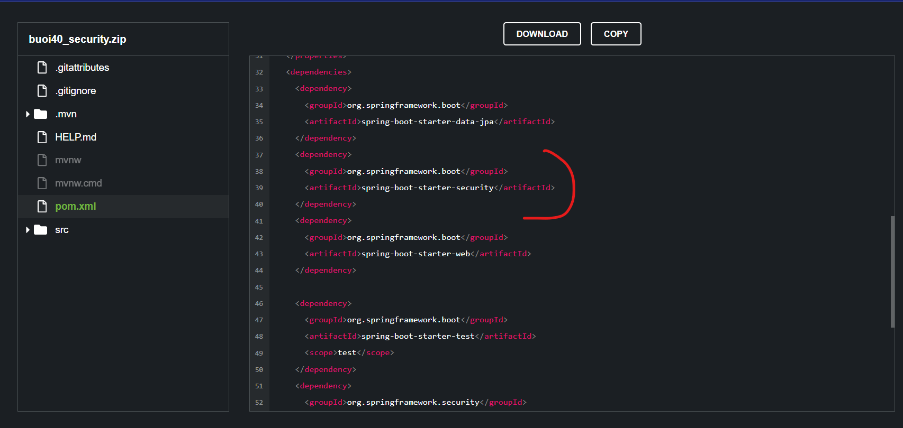

## Buổi 40
----------
- sửa bài của nhóm Trí

- mở source chạy

```js
$(document).ready(function function_name(argument) {
	// code logic ở đây
})
```


```html
<div class="d-grid my-3" id="btn-login">
  <a href="#" class="btn btn-dark btn-lg rounded-1">Log In</a>
</div>
```

```html
  <script src="js/account.js"></script>
```


```html
                    <input type="text" id="login_email" name="email" placeholder="Enter email address"
                      class="form-control mb-3 p-4">
                    <input type="password" id="login_password" placeholder="Enter password"
                      class="form-control mb-3 p-4" aria-describedby="passwordHelpBlock">
```

Đóng tất cả tiến trình đang sử dụng target/
Nếu bạn đang chạy ứng dụng bằng java -jar, hãy dừng lại trước khi build lại:
```sh
taskkill /F /IM java.exe
```
Đóng IntelliJ IDEA, Eclipse, hoặc bất kỳ chương trình nào đang mở thư mục target/.


```js
$.ajax({
  method: "POST",
  url: "some.php",
  data: { name: "John", location: "Boston" }
})
  .done(function( msg ) {
    alert( "Data Saved: " + msg );
  });
```

postman - jquery có viết sẵn code

 giới thiệu lỗi cor

```js
$(document).ready(function function_name(argument) {
	// code logic ở đây
	$('#btn-login').click(function(){
		var email = $('#login_email').val();
		var password = $('#login_password').val();
		console.log("Kiểm tra: " + email + " - " + password);


		$.ajax({
		  method: "POST",
		  url: "http://localhost:8080/auth/sign-in",
		  data: { email: email, password: password }
		})
		  .done(function( result ) { // trả kết quả của đường dẫn này
		    console.log( "Data Saved: ", result );
		    if(result.data){
		    	alert("Đăng nhập thành công");
		    } else {
		    	alert("Đăng nhập thất bại");
		    }
		  });

	})
});
```

btvn: làm api đăng kí và gọi front-end api đăng kí
```
Spring Security là một framework cung cấp các phương thức chứng 
thực như Authentication, Authorization để bảo vệ ứng dụng khỏi sự tấn 
công thường gặp của hacke
```
Authentication: mình chứng minh được mình là nhân viên công ty mình zô được công ty zòi
Authorization: chứng minh xong rùi, mình đc phép vào công ty ròi, nhưng cty có nhìu chức vụ, mình hông đc phép zô phòng ban đó

Spring secu hỗ trợ các này và chống hack cơ bản

tính năng sẵn spring security, chủ íu xài:
- chủ íu 20% LDAP
- xài authorization

Sơ đồ hoạt động của Spring Security: giống cái design pattern, nó sẽ viết 1 bảo vệ, 1 đống filter ở trỏng tự động, mỗi filter là 1 chức năng riêng, 


lên spring init thêm security

```xml
    <dependency>
      <groupId>org.springframework.boot</groupId>
      <artifactId>spring-boot-starter-security</artifactId>
    </dependency>
```
bấm nút reload của maven
bấm reload
```cmd
Using generated security password: 06ab4f81-2c0f-46a6-a0e6-6d4b37090f73
```
gọi postman lại api signin sẽ bị 401/403, mặc định nó chặn hết tất cả đường dẫn tới khi mình cấu hình
làm sao custom chặn hay ko chặn của spring security
```
 Tạo class SecurityConfig để tiến 
hành kế thừa Spring Security và 
quy định rule Security cho ứng 
dụng.- Package config là nơi chứa tất cả 
các class liên quan tới cầu hình 
của ứng dụng
```

```java
@Configuration
@EnableWebSecurity
public class SecurityConfig {

}
```

```java
@Configuration
@EnableWebSecurity
public class SecurityConfig {
    @Bean
    public SecurityFilterChain securityFilterChain (HttpSecurity http) throws Exception {
        http.csrf(csrf -> csrf.disable());
        return null;
    }
}
```

mÌnh phải disable csrf là sao, nó giúp chống hack sao tắt nó?

iu cầu mình mong muốn là đăng nhập trình duyệt nào, token nào thì ăn mỗi trình duyệt đó token đó

mình đăng nhập trình duyệt này tạo token này thì chỉ zô đúng trình duyệt đó

mình đang làm api nên mình cần phải tắt tạm cái csrf 

```java
		http.csrf(csrf -> csrf.disable())
                .authorizeHttpRequests(request -> {

                });
        return null;

```

giới thiệu lambda function, bên ngoài ngừi ta xài lambda vì tính flexible của nó, xài nhìu

```java
                    request.requestMatchers("/auth/sign-in").permitAll();
                    request.anyRequest().authenticated();
```

tất cả đoạn còn lại đều có đường dẫn chứng thực trừ cái `/auth/sign-in`, nếu đường dẫn người ta gọi, bất kì cái gì 
nè nếu chỗ này 2, 3 đường dẫn thì phẩy tiếp `("/auth/sign-in")`

bữa sau học spring security nhưng tầm cao hơn


