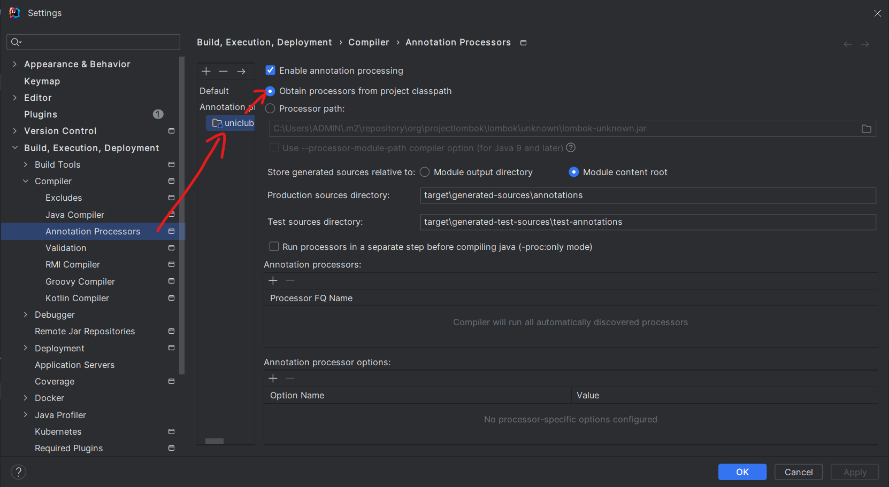

## buổi 41

nếu như em phỏng vấn đậu thì em phỏng vấn vị trí gì, dự án nào, ngừi ntn
rã task càng chi tiết, est chi tiết subtab càng cụ thể càng chuẩn
đọc doc ba để biết subtab 


ở mấy be mà mún đăng nhập


 JWT - Cách Thức Hoạt Động

 JWT - Cấu Trúc

SHA1 <=> SHA256
cái sha1 nó là mã hóa 2 chiều về cơ bản

mún mã hóa phải sinh ra secret key: đây là chìa khóa

Để mã hóa: data + secret key = chuỗi mã hóa

Giải mã được: token được mã hóa + secret key = data 


RSA => PGP (Dark web): bảo mật tối đa cho nhìu đối tác

Một cặp key:
- public key: tuồng ra bên ngoài. Chỉ dùng để mã hóa
- private key: key chuyên để giải mã

anh tạo 1 cặp 
- private key a1
- public key a

data + A1 = token
bây giờ mất a1 thì coi như tạo thêm token mới b cũng ko thể sử dụng token được nữa

khi lỡ mất public key rsa vẫn cho phép sinh ra public key mới

làm thử ssh key trên git là biết

bên ngoài có chuẩn mã hóa bcrypt hay xài, bank cũng hay xài

[jjwt]{https://github.com/jwtk/jjwt}

[bscrypt]{https://bcrypt-generator.com/}

```java
@Service
public class AuthenticationServicesImp implements AuthenticationService {
    @Autowired
    private UserRepository userRepository;

    @Override
    public boolean authenticate(String username, String password) {
        return false;
    }
}
```

```java
@Configuration
@EnableWebSecurity
public class SecurityConfig {
    // thêm cái này
    @Bean
    public PasswordEncoder passwordEncoder(){
        return new BCryptPasswordEncoder();
    }
    //đó

    @Bean
    public SecurityFilterChain securityFilterChain (HttpSecurity http) throws Exception {
        return http.csrf(csrf -> csrf.disable())
                .authorizeHttpRequests(request -> {
                    request.requestMatchers("/auth/sign-in").permitAll();
                    request.anyRequest().authenticated();
                }).build();
    }
}
```

```java
@Service
public class AuthenticationServicesImp implements AuthenticationService {
    @Autowired
    private PasswordEncoder passwordEncoder; // new

    @Autowired
    private UserRepository userRepository;

    @Override
    public boolean authenticate(String username, String password) {
        
        return false;
    }
}
```

```java
@Repository
public interface UserRepository extends JpaRepository<User, Integer> {
    Optional<User> findByUsernameAndPassword(String username, String password);
    Optional<User> findByUsername(String username); //new
}
```


hỏi trí zụ bản quyền, reset đồ đó

jwt install bỏ zô pom.xml
```xml
<dependency>
    <groupId>io.jsonwebtoken</groupId>
    <artifactId>jjwt-api</artifactId>
    <version>0.12.6</version>
</dependency>
<dependency>
    <groupId>io.jsonwebtoken</groupId>
    <artifactId>jjwt-impl</artifactId>
    <version>0.12.6</version>
    <scope>runtime</scope>
</dependency>
<dependency>
    <groupId>io.jsonwebtoken</groupId>
    <artifactId>jjwt-jackson</artifactId> <!-- or jjwt-gson if Gson is preferred -->
    <version>0.12.6</version>
    <scope>runtime</scope>
</dependency>
```

[create safe key](https://github.com/jwtk/jjwt?tab=readme-ov-file#creating-safe-keys)

```java
@RestController
@RequestMapping("/auth")
@CrossOrigin("http://127.0.0.1:8000/")
public class AuthenticationController {
    @Autowired
    private AuthenticationService authenticationService;

    @PostMapping("/sign-in")
    public ResponseEntity<?> signIn(@RequestParam String email, @RequestParam String password){
        SecretKey key = Jwts.SIG.HS256.key().build(); //or HS384.key() or HS512.key()
        
        boolean isSuccess = authenticationService.authenticate(email, password);

        BaseResponse response = new BaseResponse();
        response.setData(isSuccess);
        response.setMessage(isSuccess? "Successful Login!": "Failure !");
        response.setCode(200);

        return ResponseEntity.ok(response);
    }
}
```

xử lỗi 

```bash
java: cannot find symbol
  symbol:   method getPassword()
  location: variable user of type com.cybersoft.uniclub08.entity.User
```



```java
@RestController
@RequestMapping("/auth")
@CrossOrigin("http://127.0.0.1:8000/")
public class AuthenticationController {
    @Autowired
    private AuthenticationService authenticationService;

    @PostMapping("/sign-in")
    public ResponseEntity<?> signIn(@RequestParam String email, @RequestParam String password){
        SecretKey key = Jwts.SIG.HS256.key().build(); //or HS384.key() or HS512.key()
        String secretString = Encoders.BASE64.encode(key.getEncoded());

        System.out.println("Key: "+secretString);
        
        boolean isSuccess = authenticationService.authenticate(email, password);

        BaseResponse response = new BaseResponse();
        response.setData(isSuccess);
        response.setMessage(isSuccess? "Successful Login!": "Failure !");
        response.setCode(200);

        return ResponseEntity.ok(response);
    }
}
```
```java
  SecretKey key = Jwts.SIG.HS256.key().build(); //or HS384.key() or HS512.key()
        String secretString = Encoders.BASE64.encode(key.getEncoded());

        System.out.println("Key: "+secretString);
```
gọi api sign-in 

3 dòng mục đích là sinh ra key để sinh ra token
lưu token zô yaml
```yaml
  jpa:
    hibernate:
      ddl-auto: none
    properties:
      hibernate.transaction.jta.platform: org.hibernate.engine.transaction.jta.platform.internal.JBossAppServerJtaPlatform

jwt:
  secret: bTYE4HJo2KZYoFqPHxBRwNlriOkbecBnQNs4jEvwmDQ=
```

```java
package com.cybersoft.uniclub08.utils;

import org.springframework.beans.factory.annotation.Value;
import org.springframework.stereotype.Component;

@Component
public class JwtHelper {
    @Value("${jwt.secret}")
    private String secret;
}
```


btvn:
- lên mạng tìm hiểu code, chỉ cần nhìn sơ đồ, tự tìm tài liệu tự code lại được thì thành công, chứ đừng có nhìn code a bình cop lại
- hdbank có tuyển lứa intern tháng 6 nữa nè
- shb, shopee, sendo, lazada, hdbank, acb (lương bèo), 


