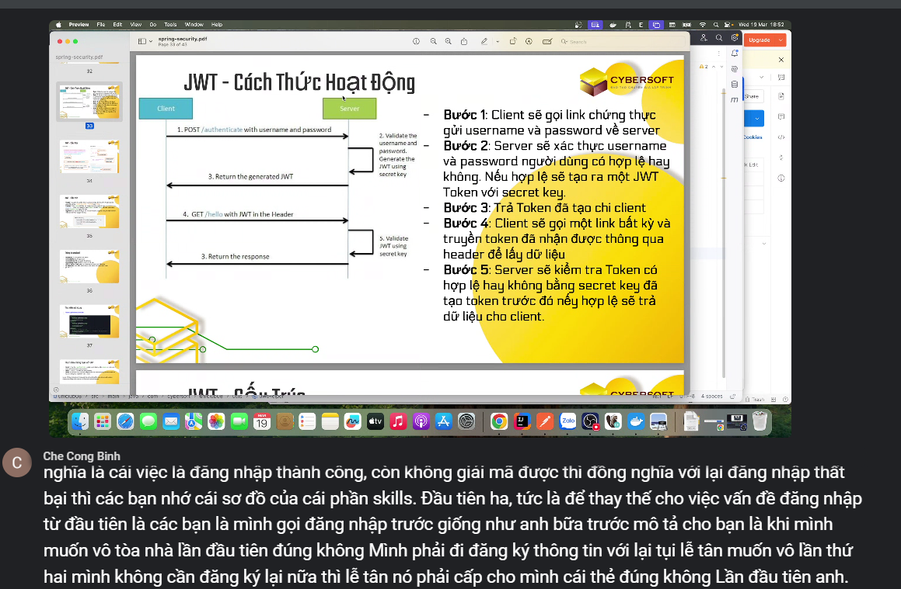
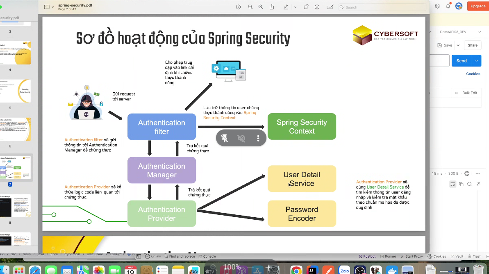
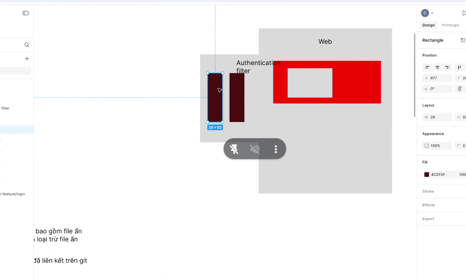
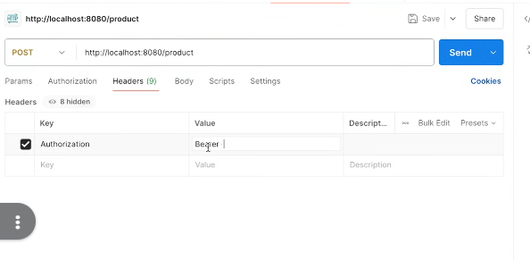
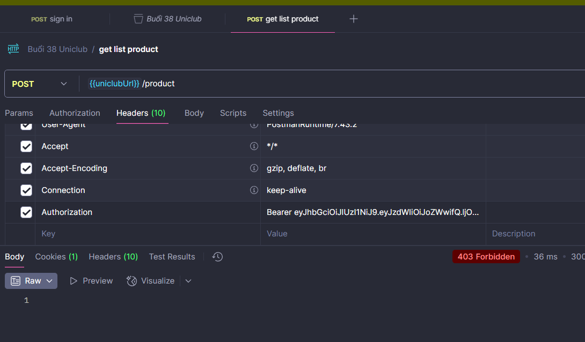
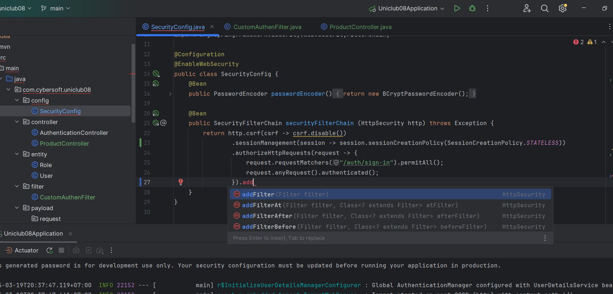

# buổi 42

hỏi trí zụ bản quyền, reset đồ đó

sha1
- Phỏng vấn: cơ chế hoạt động của jwt? cơ chế hoạt động của token của mình hoạt động ntn
  - để tránh truyền username password, vì risk của username password rất cao, dễ bị ăn cắp
  - khi gọi các api cần chứng thực, vậy thì mình bị spam db liên tục, ko hợp lý
  - đại diện cho 1 token hoạt động thành công hay 
    - xong server sẽ giải mã token đó, giải mã được là đăng nhập thành công, ko được là đăng nhập thất bại




- tại sao lại xài token

bây giờ bài tập tại lớp, viết cho anh cái hàm giải mã token truyền vào

```java
@Component
public class JwtHelper {
    @Value("${jwt.secret}")
    private String secret;

    public String  generateToken(String data){
        SecretKey key = Keys.hmacShaKeyFor(Decoders.BASE64.decode(secret));
        return Jwts.builder().subject(data).signWith(key).compact();
    }

    public String decodeToken(String token){
        SecretKey key = Keys.hmacShaKeyFor(Decoders.BASE64.decode(secret));
        return Jwts.parser().verifyWith(key).build().parseSignedClaims(token).getPayload().getSubject(); // we need a key
    }
}
```
[tìm code đó ở đây](https://github.com/jwtk/jjwt?tab=readme-ov-file#quickstart)
```java
@Component
public class JwtHelper {

    public String decodeToken(String token){
        SecretKey key = Keys.hmacShaKeyFor(Decoders.BASE64.decode(secret));
        String data = null;
        try {
            data = Jwts.parser().verifyWith(key).build().parseSignedClaims(token).getPayload().getSubject(); // we need a key
        } catch (ExpiredJwtException e){
            System.out.println("Token expired");
        } catch (JwtException e){
            System.out.println("Decode error");
        }
        return data;

    }
}

```
[commit này có hết](https://github.com/hoa-nguyen-bk/uniclub08/commit/6639aaf54b860a37cf8c9676b64fff7d3661cd5a)

```java
@RestController
@RequestMapping("/product")
public class ProductController {
    @PostMapping
    public ResponseEntity<?> insertProduct(){
        return ResponseEntity.ok("Hello insert product");
    }
}

```

thêm cái productController

gọi api /product sẽ bị 403

- bây giờ lấy token gửi lên, và giải mã token đó
- mình truy cập zô spring security context, là tờ giấy thông hành, khi có giấy thông hành security chạy tiếp, cho phép zô api product

- trong 1 đống filter của cái spring boot thì có rất nhìu filter nằm đây



- tạo ra package mới đặt tên là `filter`
- tạo CustomAuthenFilter bên trong
```java
package com.cybersoft.uniclub08.filter;

import org.springframework.stereotype.Component;

@Component
public class CustomAuthenFilter {

}

```

thêm extends OncePerRequestFilter
```java
@Component
public class CustomAuthenFilter extends OncePerRequestFilter {

}
```


giới thiệu về token


thấy vậy là đang xài jwt

basic: token mã hóa dạng base64, sinh ra theo chuẩn jwt



bây giờ phải cắt cái chữ Bearer ra

```java
@Component
public class CustomAuthenFilter extends OncePerRequestFilter {
    @Override
    protected void doFilterInternal(HttpServletRequest request, HttpServletResponse response, FilterChain filterChain) throws ServletException, IOException {
        String authenHeader = request.getHeader("Authorization");
        System.out.println("Kiem tra = "+ authenHeader);
    }
}
```
bây giờ cần phải khai báo nó zô đâu đó để xài

bây giờ phải quay lại file security config

```java
@Configuration
@EnableWebSecurity
public class SecurityConfig {
    @Bean
    public PasswordEncoder passwordEncoder(){
        return new BCryptPasswordEncoder();
    }

    @Bean
    public SecurityFilterChain securityFilterChain (HttpSecurity http) throws Exception {
        return http.csrf(csrf -> csrf.disable())
                .sessionManagement(session -> session.sessionCreationPolicy(SessionCreationPolicy.STATELESS))
                .authorizeHttpRequests(request -> {
                    request.requestMatchers("/auth/sign-in").permitAll();
                    request.anyRequest().authenticated();
                }).build();
    }
}
```

và mình disable session ở đây luôn
```java
.sessionManagement(session -> session.sessionCreationPolicy(SessionCreationPolicy.STATELESS))
```

### Giải thích đoạn code `.sessionManagement(session -> session.sessionCreationPolicy(SessionCreationPolicy.STATELESS))`

#### **1. Mục đích của đoạn code**
Dòng code này trong `SecurityConfig` có nhiệm vụ thiết lập **chính sách quản lý phiên (session management policy)** cho ứng dụng Spring Security. Cụ thể:

```java
.sessionManagement(session -> session.sessionCreationPolicy(SessionCreationPolicy.STATELESS))
```

- **`SessionCreationPolicy.STATELESS`**: Cấu hình này báo cho Spring Security rằng **không sử dụng session để lưu trạng thái xác thực của người dùng**.
- Điều này có nghĩa là:
  - Spring Security **sẽ không tạo hoặc duy trì session**.
  - Mỗi request đều phải tự mang theo thông tin xác thực (ví dụ: JWT Token).
  - Phù hợp với kiến trúc RESTful API, nơi mà authentication dựa vào token chứ không phải session.

#### **2. Tại sao cần `STATELESS` trong JWT Authentication?**
Vì bạn đang sử dụng **JWT Token** để xác thực người dùng, nên cần đảm bảo rằng mỗi request đều **tự chứa thông tin xác thực**, thay vì dựa vào session như cách truyền thống.

- Nếu **không đặt `STATELESS`**, Spring Security có thể tự động tạo session cho user sau khi họ đăng nhập, điều này sẽ vô hiệu hóa cơ chế JWT vì request tiếp theo có thể không cần gửi token mà vẫn được xác thực thông qua session.
- Khi đặt **`STATELESS`**, mỗi request bắt buộc phải **chứa JWT Token hợp lệ** trong `Authorization` header để được xác thực.

#### **3. Cách hoạt động của hệ thống bảo mật khi `STATELESS`**
1. Người dùng đăng nhập (`/auth/sign-in`) và nhận được một JWT Token.
2. Khi truy cập API `/product`, client phải gửi kèm token trong header `Authorization: Bearer <JWT_TOKEN>`.
3. **CustomAuthenFilter** sẽ kiểm tra token, giải mã, và xác thực danh tính người dùng.
4. Nếu token hợp lệ, Spring Security sẽ cho phép request tiếp tục.
5. **Không có session nào được tạo**, mỗi request đều độc lập.

#### **4. Tóm tắt**
- `.sessionCreationPolicy(SessionCreationPolicy.STATELESS)` đảm bảo **Spring Security không tạo và không lưu session**, bắt buộc mỗi request phải tự xác thực qua JWT Token.
- Phù hợp với **RESTful API** không duy trì trạng thái của client.
- Giúp hệ thống **bảo mật hơn, giảm tải tài nguyên**, không cần quản lý session.

Bạn có thể tiếp tục bằng cách thêm `CustomAuthenFilter` vào `SecurityFilterChain` để xử lý xác thực JWT trên mọi request. 🚀


vậy thì giờ add before hay after, mặc định là tất cả after

vậy nên mình cần add trước

```java
@Configuration
@EnableWebSecurity
public class SecurityConfig {
    @Bean
    public PasswordEncoder passwordEncoder(){
        return new BCryptPasswordEncoder();
    }

    @Bean
    public SecurityFilterChain securityFilterChain (HttpSecurity http, CustomAuthenFilter customAuthenFilters) throws Exception {
        return http.csrf(csrf -> csrf.disable())
                .sessionManagement(session -> session.sessionCreationPolicy(SessionCreationPolicy.STATELESS))
                .authorizeHttpRequests(request -> {
                    request.requestMatchers("/auth/sign-in").permitAll();
                    request.anyRequest().authenticated();
                })
                .addFilterBefore()
                .build();
    }
}
```
CustomAuthenFilter customAuthenFilters này nó sẽ truyền theo cái tham số, ko cần phải lên ioc lấy, cách này sẽ lấy được giá trị ko cần dùng cách cũ

```java
@Component
public class CustomAuthenFilter extends OncePerRequestFilter {
    @Override
    protected void doFilterInternal(HttpServletRequest request, HttpServletResponse response, FilterChain filterChain) throws ServletException, IOException {
        String authenHeader = request.getHeader("Authorization");
       -> if(authenHeader!= null && authenHeader.startsWith("Bearer ")){
       ->     String token = authenHeader.substring(7);
       ->     System.out.println("token: " + token);
       -> }
    }
}

```

```java
    @Override
    protected void doFilterInternal(HttpServletRequest request, HttpServletResponse response, FilterChain filterChain) throws ServletException, IOException {
        String authenHeader = request.getHeader("Authorization");
        if(authenHeader!= null && authenHeader.startsWith("Bearer ")){
            String token = authenHeader.substring(7);
            System.out.println("token: " + token);
            String data = jwtHelper.decodeToken(token);
            System.out.println("data = "+data);
            if(data!= null){ //success authen
->                SecurityContext securityContext = SecurityContextHolder.getContext();
            }
        }
    }
```
```java
            if(data!= null){ //success authen
                UsernamePasswordAuthenticationToken authenticationToken =
                        new UsernamePasswordAuthenticationToken("", "", List.of());
                // create giay thong hanh
                
                SecurityContext securityContext = SecurityContextHolder.getContext();

            }
```
- List.of() là quyền, bữa sau mình sẽ học
- tạm thời để rỗng, bữa sau mình phân thêm quyền
```java
            if (data != null) { //success authen
                UsernamePasswordAuthenticationToken authenticationToken =
                        new UsernamePasswordAuthenticationToken("", "", List.of());
                // create giay thong hanh

                SecurityContext securityContext = SecurityContextHolder.getContext();
                securityContext.setAuthentication(authenticationToken);
            }
```
`securityContext.setAuthentication(authenticationToken);`:  dòng này là chạy giấy thông hành thành công


## buổi sau:
- học upload file

### itviec
- cathay dọn rác, 
- acb tuyển quài
- nec theo mentor kha lớp java 07, nec phông bạt
- dosoftpro: dư sức đi làm
- total software bankL 06 fresher/junior software people
- sacombank
- shinhank bank tụi hàn
- mirae asset cạnh tranh cũng ghê, công ty của hàn
- tpi software a bình đang làm
- giờ đang đợt review lương, hông được thì nhìu người nhảy