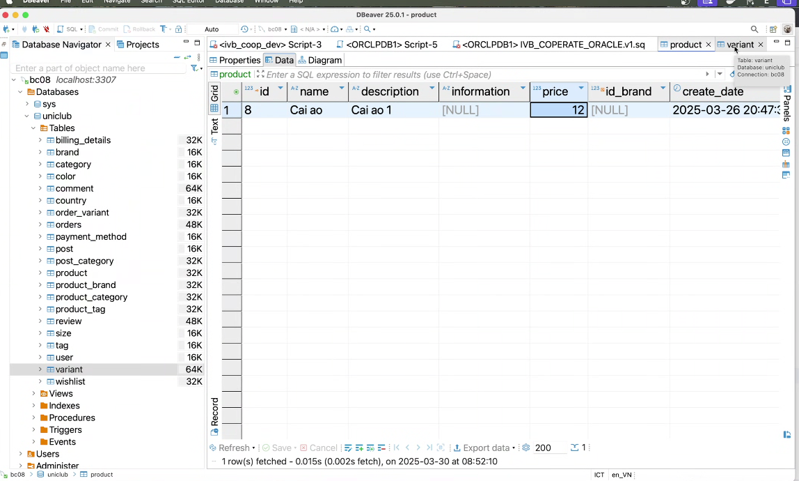
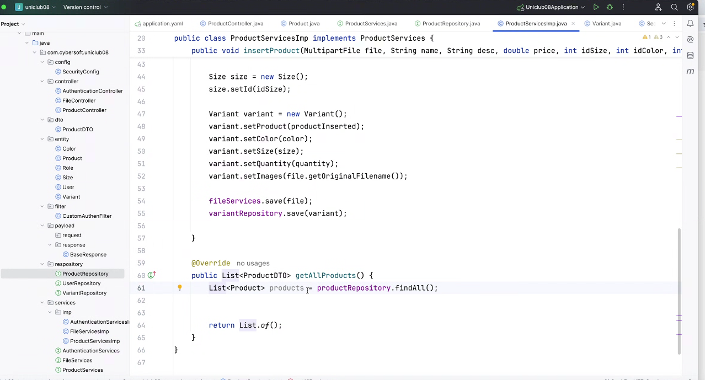
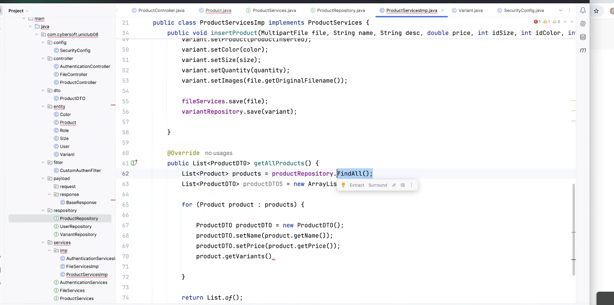
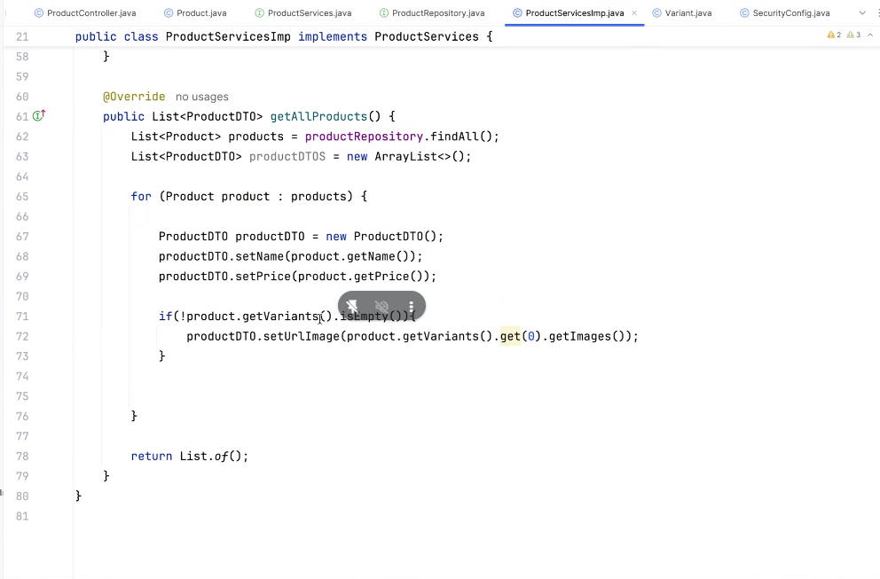
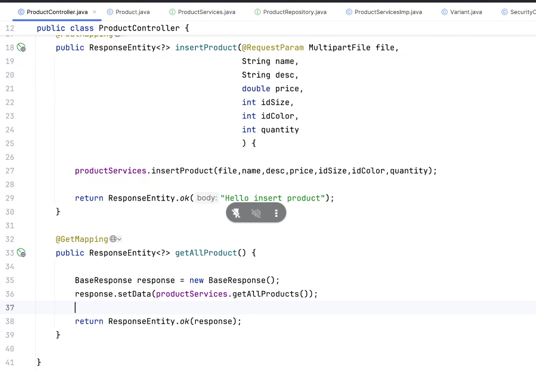
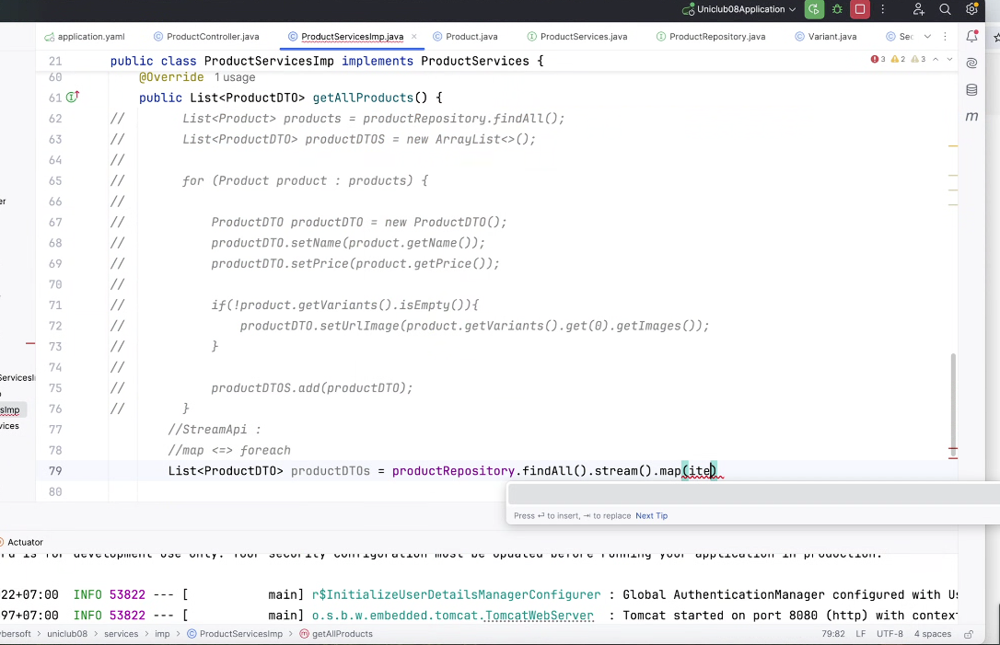
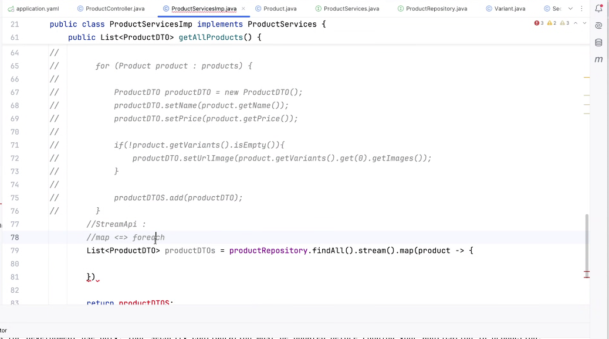
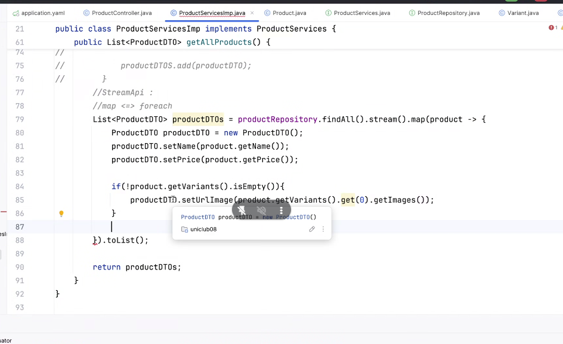
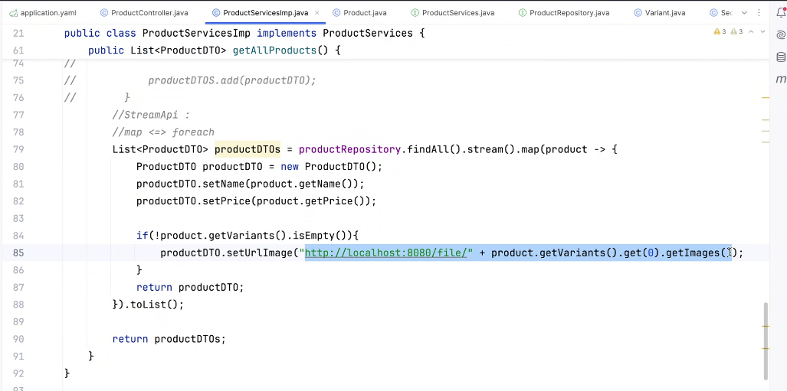

buổi 45:

- hdbank training tốt
- cmc global tốt

### 2 câu hỏi

### mún dự án ngon ngon thì cần bổ sung thêm:
- thêm discount
- giảm giá 
- voucher
- thứ hạng user giống soppe
  - hạng bạch kim có user bao nhiêu point, đc giảm giá vz sp nào
- tính điểm tích điểm, 1 năm ko tích cook

## bài buổi 44

cái áo bên ngoài load random, tài liệu BA có mô tả 

cái áo bên trong sẽ lấy hình theo màu/size

lấy detail của product lấy bảng product, và bảng variant, khi map product, nó sẽ tự động truy vấn các bảng còn lại cho bạn

tạo dto, hông cần phải mapping 100%, nó cũng có giúp mình, 1 số trường hợp cũng cần

mặc định là  eager, tự động truy vấn cho mình, còn lazy là khi gọi nó mới truy vấn, đa số bên ngoài xài lazy 

Stream api: 
map <=> foreach

[cor](https://docs.spring.io/spring-security/reference/reactive/integrations/cors.html?fbclid=IwZXh0bgNhZW0CMTEAAR2QVnNyKH-9dr4mfLn4jG9ixmNeYh2sMEpd_3hjo-fxQ6O-XlnyeW0fH4g_aem_6BMZ_p71owrdSs-NxzmHwA)

nói thiệt hem còn cái nào ngoài lombok à a
từ khóa là gì á anh em tìm hỉu a -> record

https://extension.app.scribbl.co/share/meeting/5bff2530-72a2-4bcf-a0e8-5a608c3eb7c0