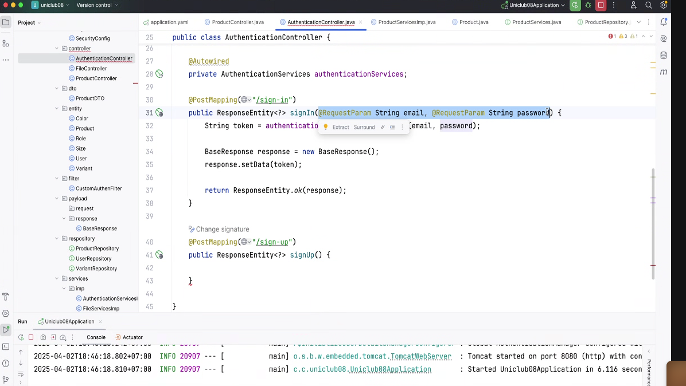
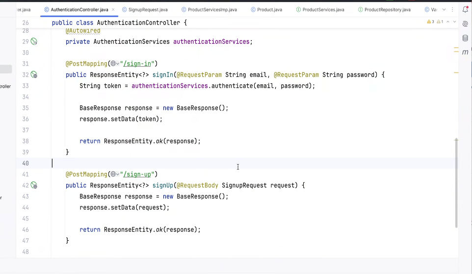
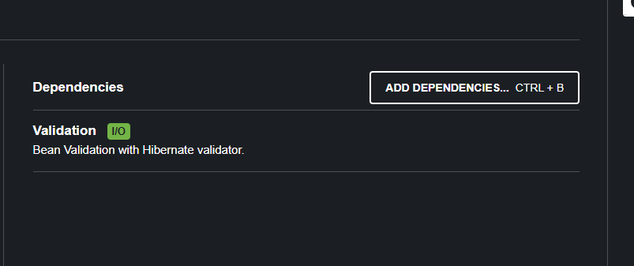
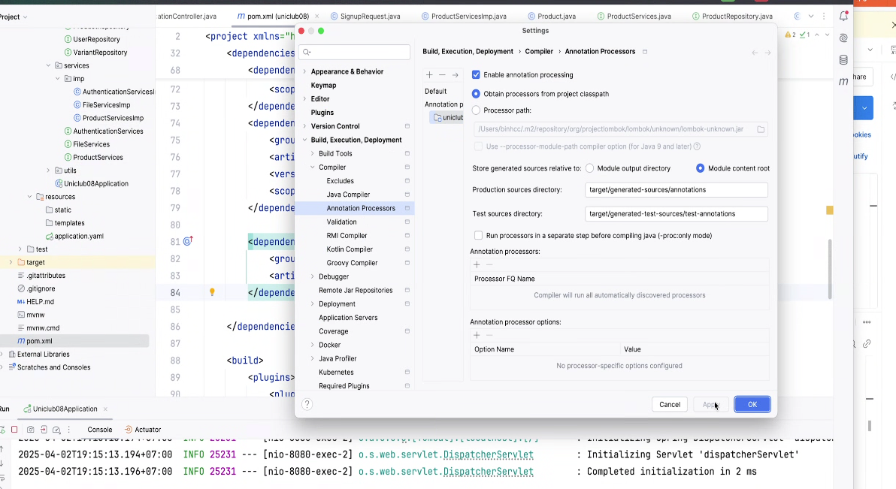
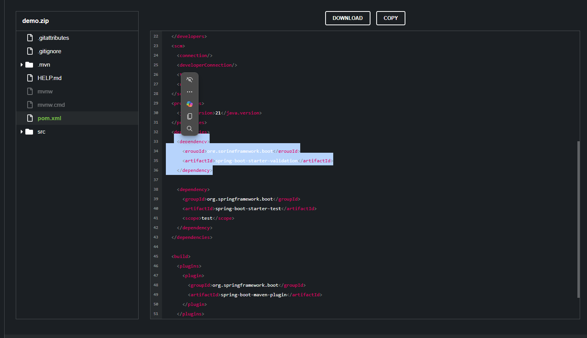
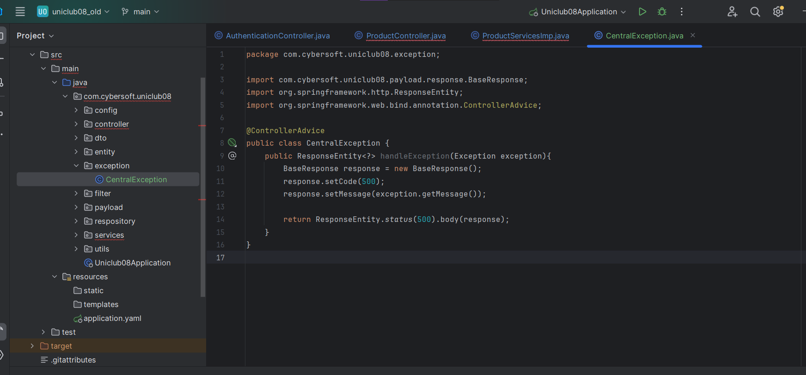
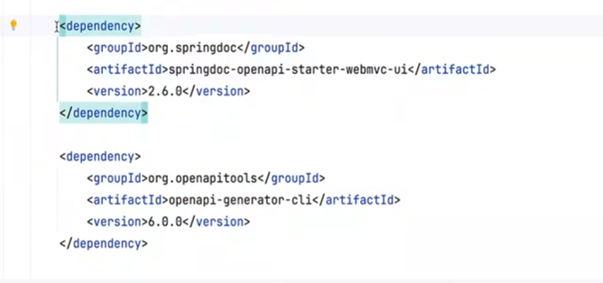

anh Bình nhận xét db của mình
- appoinment nó giống cái booking
- attachment là chỉnh định bác sĩ, chẩn đoán của bác sĩ
  - chỉ cần 1 trường attachment, attachment của bác sĩ và bệnh nhân chung lun
- discount cho lúc anh book hay cho nguyên chi phí a điều trị
- booking history, ai là người tác động
  - ghi nhận lịch sử để trade lại history của 1 dòng dữ liệu
- booking phải truy vấn 1 lần nữa, check lại một lần nữa mới check






json là RequestBody


https://start.spring.io/


```
    <dependency>
      <groupId>org.springframework.boot</groupId>
      <artifactId>spring-boot-starter-validation</artifactId>
    </dependency>
```




[valid](https://techmaster.vn/posts/36877/xac-thuc-request-bang-spring-boot-validation?fbclid=IwZXh0bgNhZW0CMTEAAR3xjM71fLV8w5Vk234jkSSa9XzCLUXLi2_nl1HElNw3sD4N_AFb2ik5YhM_aem_8C_mlyURadkyfOjVB2OWWA)

https://regexr.com/

```
^(?=.*[A-Z].*[A-Z])(?=.*[!@#$&*])(?=.*[0-9].*[0-9])(?=.*[a-z].*[a-z].*[a-z]).{8}$
```



2025-04-02T19:37:05.254+07:00  WARN 13632 --- [nio-8080-exec-4] .w.s.m.s.DefaultHandlerExceptionResolver : Resolved [org.springframework.web.bind.MethodArgumentNotValidException: Validation failed for argument [0] in public org.springframework.http.ResponseEntity<?> com.cybersoft.uniclub08.controller.AuthenticationController.signUp(com.cybersoft.uniclub08.payload.request.SignupRequest): [Field error in object 'signupRequest' on field 'password': rejected value [123]; codes [Pattern.signupRequest.password,Pattern.password,Pattern.java.lang.String,Pattern]; arguments [org.springframework.context.support.DefaultMessageSourceResolvable: codes [signupRequest.password,password]; arguments []; default message [password],[Ljakarta.validation.constraints.Pattern$Flag;@159497ea,^(?=.*[A-Z].*[A-Z])(?=.*[!@#$&*])(?=.*[0-9].*[0-9])(?=.*[a-z].*[a-z].*[a-z]).{8}$]; default message [must match "^(?=.*[A-Z].*[A-Z])(?=.*[!@#$&*])(?=.*[0-9].*[0-9])(?=.*[a-z].*[a-z].*[a-z]).{8}$"]] ]

```java
@Data
public class SignupRequest {
    private String fullname;

    @NotNull
    @Pattern(regexp = "^(?=.*[A-Z].*[A-Z])(?=.*[!@#$&*])(?=.*[0-9].*[0-9])(?=.*[a-z].*[a-z].*[a-z]).{8}$\n")
    private String password;

    @NotNull(message = "Email is not null")
    @NotEmpty(message = "Email is not empty")
    @Email(message = "Wrong email format")
    private String email;

}
```

trong file 
```java
@Service
public class ProductServicesImp implements ProductServices {
    @Transactional()
    @Override
    public void insertProduct(MultipartFile file, String name, String desc, double price, int idSize, int idColor, int quantity) {
        try {
            Product product = new Product();
            product.setName(name);
            product.setDescription(desc);
            product.setPrice(price);

            Product productInserted = productRepository.save(product);

            Color color = new Color();
            color.setId(idColor);

            Size size = new Size();
            size.setId(idSize);

            Variant variant = new Variant();
            variant.setProduct(productInserted);
            variant.setColor(color);
            variant.setSize(size);
            variant.setQuantity(quantity);
            variant.setImages(file.getOriginalFilename());
            fileServices.save(file);
            variantRepository.save(variant);
        }catch (Exception e){
            System.out.println("error insert product" + e.getMessage());
        }
    }

```

bọc bằng cái try catch

```java
    @Transactional
    @Override
    public void insertProduct(MultipartFile file, String name, String desc, double price, int idSize, int idColor, int quantity) {
        try {
            Product product = new Product();
            product.setName(name);
            product.setDescription(desc);
            product.setPrice(price);

            Product productInserted = productRepository.save(product);

            Color color = new Color();
            color.setId(idColor);

            Size size = new Size();
            size.setId(idSize);

            Variant variant = new Variant();
            variant.setProduct(productInserted);
            variant.setColor(color);
            variant.setSize(size);
            variant.setQuantity(quantity);
            variant.setImages(file.getOriginalFilename());
            fileServices.save(file);
            variantRepository.save(variant);
        }catch (Exception e){
            throw RuntimeException("Error insert product" + e.getMessage()); //ném exception
//            System.out.println("error insert product" + e.getMessage());
        }
    }   
```



tạo cái exceptional

```java
@ControllerAdvice
public class CentralException {
    @ExceptionHandler(RuntimeException.class)
    public ResponseEntity<?> handleException(Exception exception){
        BaseResponse response = new BaseResponse();
        response.setCode(500);
        response.setMessage(exception.getMessage());

        return ResponseEntity.status(500).body(response);
    }
}

```
 nếu như ném ra cái runtime exception thì mình kích hoạt nó
 @ExceptionHandler(RuntimeException.class)

```java
    @ExceptionHandler(MethodArgumentNotValidException.class)
    public ResponseEntity<?> handleParameter(Exception exception){
        BaseResponse response = new BaseResponse();
        response.setCode(500);
        response.setMessage(exception.getMessage());

        return ResponseEntity.status(500).body(response);
    }
```
excetipon liên quan đến lỗi

open api tool -> generate swagger tự động sinh ra 



https://www.baeldung.com/swagger-2-documentation-for-spring-rest-api

capstone:
- bắt buộc đăng nhập trả ra token

buổi sau:
- làm giỏ hàng
- junior
  - ghi log
  - catching
  - microservice
  - để vẽ mô hình, luonfg chạy ble ble là của middle


