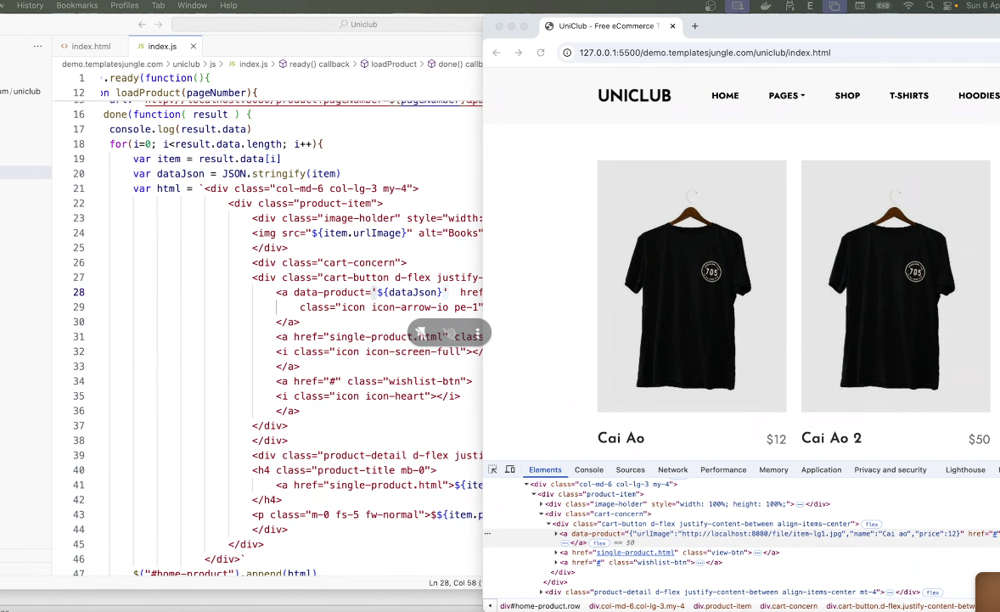
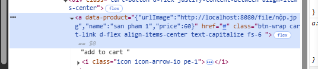

## buổi 47

sqlite, csdl lưu sẵn trong máy siu nhỏ gọn, dễ



truyền cái id của product/nguyên cục product vô localstorage bên fe a



```javascript
  $("#home_product").on('click', '.btn_cart', function () {
    // this đại diện cho class chứa btn_cart
    const stringData = $(this).attr('data-product');
    const jsonData = JSON.parse(stringData);
    const jsonArray = []
    jsonArray.push(jsonData)
    console.log(jsonArray);
    
    localStorage.set("product", jsonArray)

```

```javascript
  $("#home_product").on('click', '.btn_cart', function () {
    // this đại diện cho class chứa btn_cart
    const stringData = $(this).attr('data-product');
    const jsonData = JSON.parse(stringData);
    jsonData.quantity = 1;
    let jsonArray = []
    const cart = localStorage.getItem('cart');
    if(cart){
      const stringListCartSaved = cart;
      jsonArray = JSON.parse(stringListCartSaved);
      // jsonArray.map(item => {
      //   if(item.id == jsonData.id){
      //     item.quantity = item.quantity + 1;
      //   }
      //   return item;
      // })
      // let newArray = jsonArray.find(item => {
        // return item.id == jsonData.id
      // })
      for(i = 0)
    }
    jsonArray.push(jsonData)
    console.log(jsonArray);
    const stringListCart = JSON.stringify(jsonArray);
    localStorage.setItem("cart", stringListCart)

  })
```

```javascript
  $("#home_product").on('click', '.btn_cart', function () {
    // this đại diện cho class chứa btn_cart
    const stringData = $(this).attr('data-product');
    const jsonData = JSON.parse(stringData);
    jsonData.quantity = 1;
    let jsonArray = []
    const cart = localStorage.getItem('cart');
    if (cart) {
      const stringListCartSaved = cart;
      jsonArray = JSON.parse(stringListCartSaved);
      let finded = 0;
      for (let i = 0; i < jsonArray.length; i++) {
        if (jsonArray[i].id === jsonData.id) {
          jsonArray[i].quantity += 1;
          finded=1;
        } 
      }
      if(finded === 0){
        jsonArray.push(jsonData)
      }
    } else {
      jsonArray.push(jsonData)
    }
    const stringListCart = JSON.stringify(jsonArray);
    localStorage.setItem("cart", stringListCart)
  })
```


```javascript
  $("#home_product").on('click', '.btn_cart', function () {
    // this đại diện cho class chứa btn_cart
    const stringData = $(this).attr('data-product');
    const jsonData = JSON.parse(stringData);
    jsonData.quantity = 1;
    let jsonArray = []
    const cart = localStorage.getItem('cart');
    let finded = 0;
    if (cart) {
      const stringListCartSaved = cart;
      jsonArray = JSON.parse(stringListCartSaved);
      for (let i = 0; i < jsonArray.length; i++) {
        if (jsonArray[i].id === jsonData.id) {
          jsonArray[i].quantity += 1;
          finded = 1;
        }
      }
    }
    if (finded === 0) {
      jsonArray.push(jsonData)
    }
    const stringListCart = JSON.stringify(jsonArray);
    localStorage.setItem("cart", stringListCart)
  })
```

bữa sau zô microservice