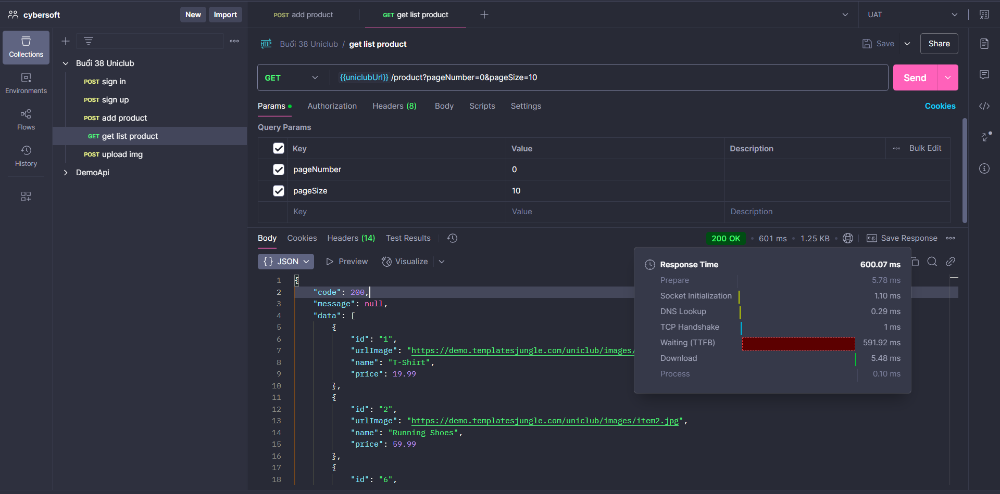
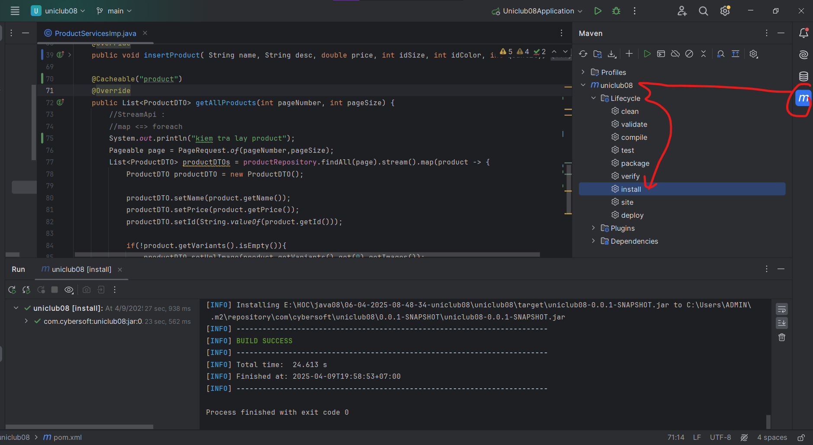
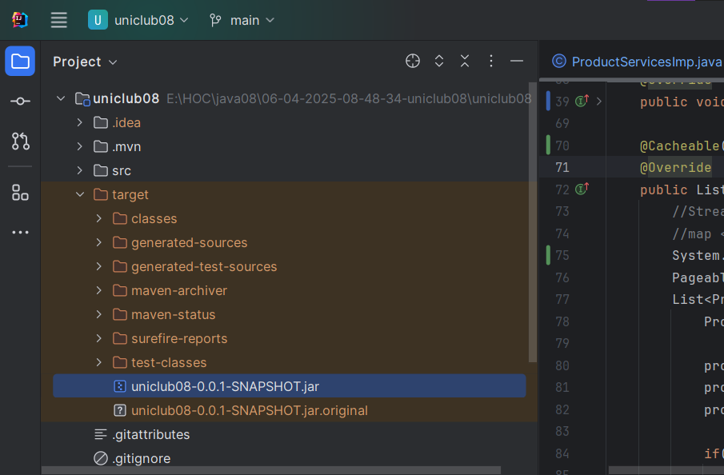
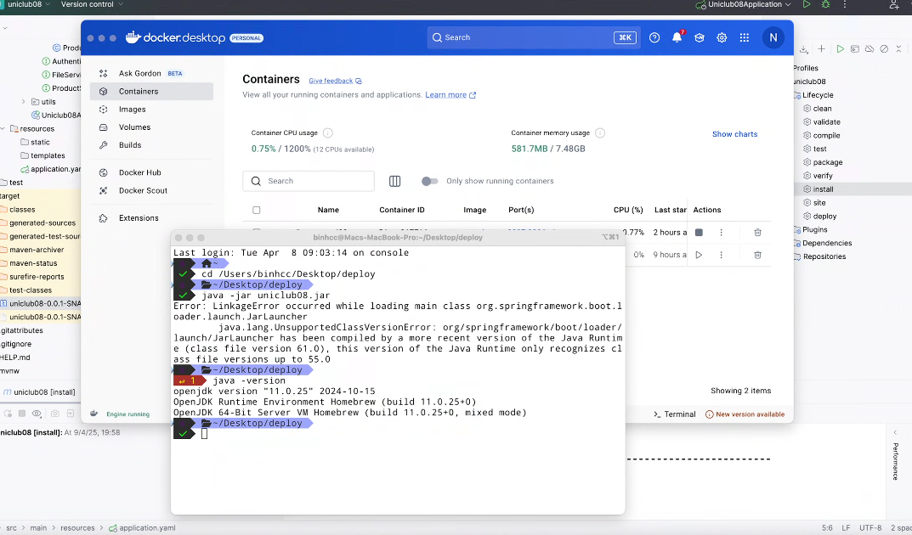
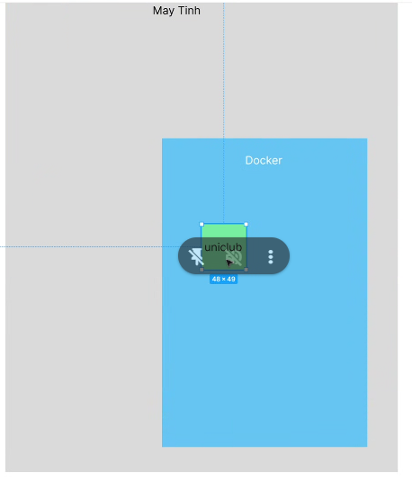
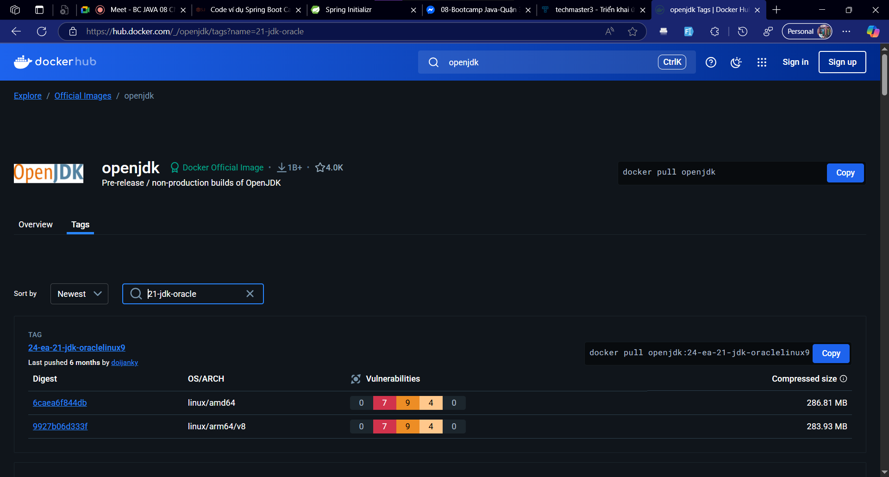
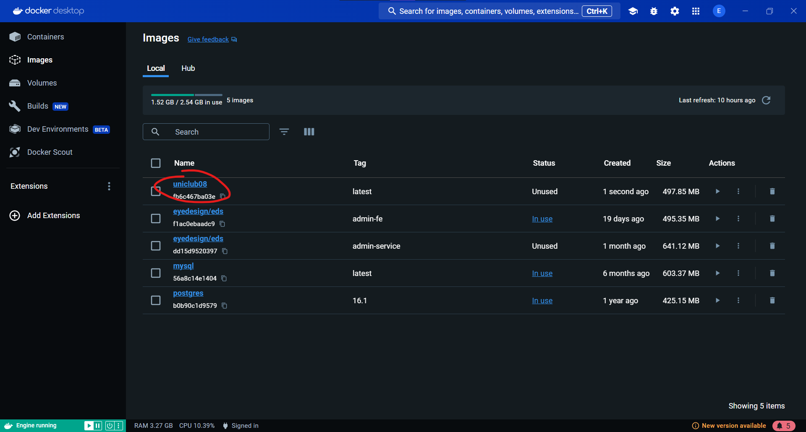
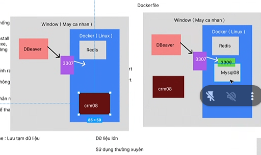
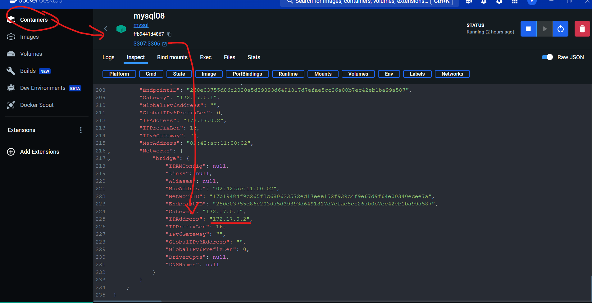
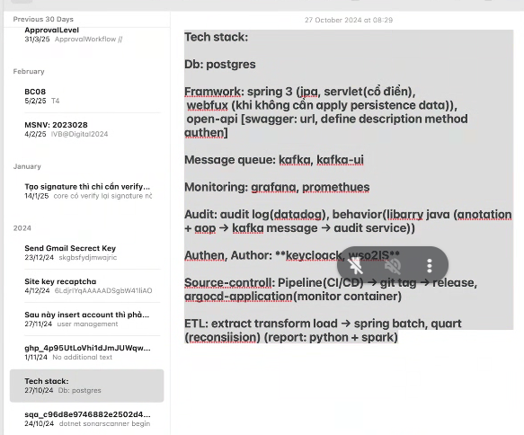

## buoi 48

[cache](https://stackjava.com/spring-boot/code-vi-du-spring-boot-caching-cacheable-cacheevict-cacheput-caching.html?fbclid=IwZXh0bgNhZW0CMTEAAR6N-nmGZRmJCF2MqiBFT9kqtNhpu9pyA4CTm5cs31syoe48PFU9i6lasHx0tA_aem_p9i3kFnz1MGNQxCy3EN1bw#google_vignette)

- cache, memory cache: lưu tạm dữ liệu ở ram, có thể là data đã được xử lý, 
  - giả sử mình có data lấy 54 tỉnh thành vịt nam bao gồm tỉnh thành phố quận huyện đường, nó gần 1 chẹo record. Mình viết 1 câu query truy vấn data các bảng rồi tự động fill các bảng lại với nhau. Câu query đó phải mất tận 5' mới ra data 54 tỉnh thành cho ngừi ta điền vô, chưa kể data nhiều người xài quá dễ bị lag lun db, data đó người ta lưu tạm, khi người ta lấy lần 2 lần 3
  - trường hợp sử dụng, khi lưu data quá lớn, dẫn tới ảnh hưởng câu query của mình trả bị chậm, thì lúc này mình cache data đó lại, data đó phải đảm bảo là nó ít thay đổi hoặc ko đổi lun càng tốt. Ví dụ như danh sách sản phẩm thay đổi liên tục, ko cache được, còn ví dụ data ko thay đổi quá nhiều, mình thay cache mỗi tối.
  - còn nhiều lúc data trả có 3, 4 dữ liệu thì nó tốn ram, cache lưu trên mem ram, nó tốn ram, sau ni nhiều dữ liệu mình lưu trên ram nó có tận 1 chẹo record
- mình xài nhiều nhất, cơ 

- tạm thời xài theo mem cache, về cơ bản bên ngoài là thường xài caching và mem cache
``` html
    <dependency>
      <groupId>org.springframework.boot</groupId>
      <artifactId>spring-boot-starter-cache</artifactId>
    </dependency>
```

- cache bỏ trong service not repo


- xong đặt mem cach và cách xử dụng

## build



```
java -jar uniclub08.jar
```



phải đóng gói file bỏ vào image, phải có 1 cái file gọi là docker file gọi là file kịch bản, 


[docker](https://techmaster.vn/posts/37808/trien-khai-ung-dung-springboot-su-dung-docker-compose?fbclid=IwZXh0bgNhZW0CMTEAAR6aPbnUszuZwUcf8yTV1udxJrTsjyil1vvb94k9r083mAVQZ7l6xIV0FHrzpg_aem_Q826_1uTbLACs986sqMtOw)

- lệnh đóng gói tất cả ứng dụng thành 1 image và start nó, thì trong file kịch bản cần phải biết
- docker là 1 máy ảo mini và có hệ đìu hành linux rồi
- và nó có thể triển khai, nó chưa có 1 cái gì hết trừ hệ điều hành

- hiện tại mình đang cần để chạy 
  - chạy cái jdk 21
  - thông qua từ khóa của workir giúp tạo folder bên trong docker chứ ko phải máy thực, và đồng thời nó mở folder đó lên, 
  - nên có workdir vì sau này nhiều folder lắm
  - nên copy 1 cái folder vào trong docker
  - cần 2 tham số, đường dẫn gói jar ở trong máy thật
  - tham số thứ 2 đường dẫn mà mình đang chép vào
  - còn có 1 lệnh CMD là câu lệnh để start
  - và còn có 1 entry point
  - mõi ứng dụng có 1 port private và phải đăng kí để use private của mình
  - ví dụ mình uniclud là 8080 và mình dùng 8080 thì dùng 
- cái khó của docker file là cần biết ứng dụng cần gì, tạo 
- tạo folder deploy bỏ cái file jar và file Dockerfile
- lên docker hub tìm jdk bỏ zô
[dockrhub](https://hub.docker.com/)




- chỉ có đúng 1 entry point
- junior level 3 phải biết kiến thức này, đây là điều kiện tiên quyết

```cmd
docker build -t uniclub08 .
```

- uniclub08 là tên image



```cmd
docker run --name uniclub -p 9090:8080 uniclub08 
```

- uniclub là tên container

- bây giờ chưa chạy đưuọc vì chưa gọi được docker




## toàn bộ tech stack toàn bộ sen mid phải biết:


### bữa sau:
- docker compose
- biến môi trường
- 


```cmd
Tech stack: 

Db: postgres

Framwork: spring 3 (jpa, servlet(cổ điển),
 webfux (khi không cần apply persistence data)),
 open-api [swagger: url, define description method authen]

Message queue: kafka, kafka-ui

Monitoring: grafana, promethues

Audit: audit log(datadog), behavior(libarry java (anotation + aop → kafka message → audit service))

Authen, Author: *keycloack, wso2IS*

Source-controll: Pipeline(CI/CD) → git tag → release, argocd-application(monitor container)

ETL: extract transform load → spring batch, quart (reconsiision) (report: python + spark)
```
- nói a bình tăng độ
# microservice
mình học cache và học đóng gói dữ liệu bằng docker
- đóng tiền học thêm microservice sẽ được:
  - elastic search
  - central lock, monitor, kalka, service message queue
  - cicd jenkin