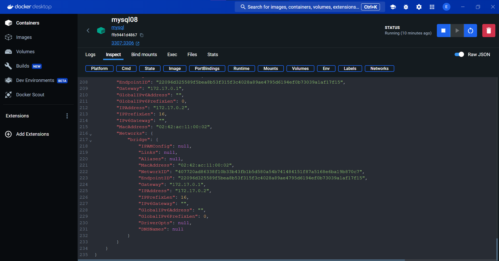
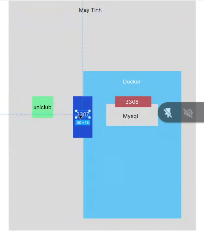
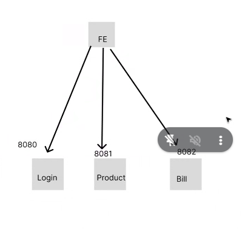
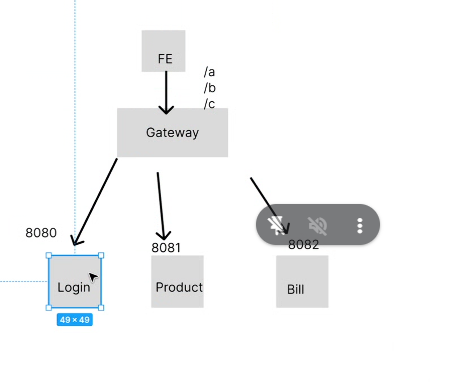
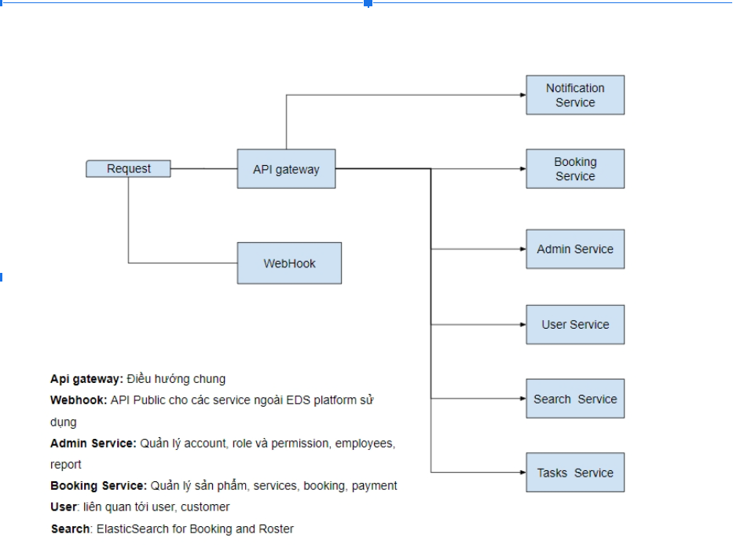

## buổi 49



IPAddress: 172.17.0.2s

nếu làm outsourcing nhì junior thì tỉ lệ tham gia càng sớm



mỗi 1 image là 1 máy ảo nhỏ có chạy hđh ở trỏng và có ip riêng, mình sẽ ko gọi được mysql nếu ko gọi được và ko có địa chỉ ip của nó

bỏ cái IP address của bên inteligi qua bên app.java

```sh
Caused by: org.hibernate.HibernateException: Unable to determine Dialect without JDBC metadata (please set 'jakarta.persistence.jdbc.url' for common cases or 'hibernate.dialect' when a custom Dialect implementation must be provided)

Process finished with exit code 1
```


```yaml
server:
  port: 8080

spring:
  datasource:
    url: jdbc:mysql://172.17.0.2:3307/uniclub06 -- chuyển cái này
    username: root
    password: admin123
```

nhưng nó ko cho mình build/install vì nó đang fail ko kết nối được

bên máy mac có phần variable, nó có phần quẩn lý biến env ở đó lun

anh Bình ko hướng dẫn cái .env mà anh bình hướng dẫn xài docker compose

đổi:
```yaml
spring:
  datasource:
    url: ${DB_URL:jdbc:mysql://localhost:3307/uniclub06}
    username: ${DB_USERNAME:root}
    password: ${DB_PASSWORD:admin123}
```

xong install

xong thành công thì xóa cái jar cũ

xog zô container của docker xóa cái containers xóa cái uniclub cũ, xong zô image xóa cái uniclub08 nếu nó có tồn tại

```sh
docker build -t uniclub08 .
```
- build th
- uniclub08 là tên image

- 1 cái container có khi nó có tới 4 cấu hình lun, vậy nên zô phải có file khai báo biến

Dockercompose
- thay thế cho việc gõ tay
- hỗ trợ lưu trữ nhìu image khác nhau, dẫn đến mình có nhu cầu start image này thui ko start image kia chẳng hạn
- tự động chạy run
- 1 container có thể có nhìu service

lên docker hub nếu ko nhớ tên image thì zô dockerhub tìm: docker pull tự động tải các file trong docker ko tải về
nếu image trong docker hub trong local trên máy thì ko có thì nó tìm

docker hub bao gồm run lun

```yml
services:
  deployuniclub: # Tên service tự đặt tên gì cũng được
    image: uniclub08 #image
    container_name: uniclub # tương đương --name tên_container
    ports: # -p 8080:8080
      - ":8080:8080"
    environment: # -e DB_URL
      - DB_URL=jdbc:mysql://172.17.0.2:3307/uniclub06
      - DB_USERNAME=root
      - DB_PASSWORD=admin123
```
sau này đổi biến môi trường khác nhau thì copy ra 3 file docker compose khác nhau, còn này chỉ là biến env thôi

```sh
docker compose up deployuniclub -d
```

- nếu ko có đưa tên service zo thì nó up hết, nó tự động tìm đến file docker compose.yml của mình
- là giải phóng màn hình terminal
- nó tự cắt tên deploy ra  deploy

còn down là xóa đi
```yml
      - DB_URL=jdbc:mysql://172.17.0.2:3306/uniclub06
```
```sh
docker compose up deployuniclub -d
```
nó tự động start lun nhưng còn lỗi:
```sh
2025-04-13 09:53:13 Caused by: org.hibernate.HibernateException: Unable to determine Dialect without JDBC metadata (please set 'jakarta.persistence.jdbc.url' for common cases or 'hibernate.dialect' when a custom Dialect implementation must be provided)
```
bổ sung thêm cái này để fix lỗi Dialect trên
```yml
    database-platform: ${DB_DIALECT:org.hibernate.dialect.MySQLDialect}
```
xóa folder targer đi, chọn install để nó build lại cho mình
đưa zô docker xóa container và image, ròi copy cái jar mới build zô bên trong folder deploy trên explore

```sh
docker build -t uniclub08 .
```

```sh
docker compose up deployuniclub -d
```
nó vẫn bị lỗi này
```sh
Caused by: com.mysql.cj.jdbc.exceptions.CommunicationsException: Communications link failure
```

[starting](https://docs.jboss.org/hibernate/orm/6.0/migration-guide/migration-guide.html?fbclid=IwZXh0bgNhZW0CMTEAAR7v8Z6sL3ylbIDbiV7Tg0ExsyOWZZWjIBigrjicbLltcD_kFARYifLv4i-z_Q_aem_AxLiw6LfpYI-WViZD3WFuw#_dialects)

```sh
docker compose down
```
xóa hết image tui mới tạo nãy

hỏi a Bình:
- nhờ anh bình nói lại sao nó tách ra folder tên là deploy->
  - deploy_default là default lun tạo deploy
- cái dialect dùng để fix bug dialect à anh, a nói lại ý nghĩa nó miếng đc hem

cũng hem bít lỗi gì thiệt

```yml
services:
  deployuniclub: # Tên service tự đặt tên gì cũng được
    image: uniclub08 #image
    container_name: uniclub # tương đương --name tên_container
    ports: # -p 8080:8080
      - "8080:8080"
    environment: # -e DB_URL
      - DB_URL=jdbc:mysql://mysql_uniclub:3306/uniclub06
      - DB_USERNAME=root
      - DB_PASSWORD=admin123
    networks:
      - uniclub

  mysql: # Tên service tự đặt tên gì cũng được
    image: mysql_uniclub #image
    container_name: uniclub # tương đương --name tên_container
    ports: # -p 8080:8080
      - "3307:3306"
    networks:
      - uniclub

networks:
  uniclub:
    driver: bridge
```


```yml
services:
  deployuniclub: # Tên service tự đặt tên gì cũng được
    image: uniclub08 #image
    container_name: uniclub # tương đương --name tên_container
    ports: # -p 8080:8080
      - "8080:8080"
    environment: # -e DB_URL
      - DB_URL=jdbc:mysql://mysql_uniclub:3306/uniclub06
      - DB_USERNAME=root
      - DB_PASSWORD=admin123
    networks:
      - uniclub

  mysql: # Tên service tự đặt tên gì cũng được
    image: mysql_uniclub #image
    container_name: uniclub # tương đương --name tên_container
    ports: # -p 8080:8080
      - "3307:3306"
    networks:
      - uniclub

networks:
  uniclub:
    driver: bridge
```

```sh
docker build -t uniclub08 . && docker compose up -d
```

```sh

```

thay vì nãy chạy 172.17 ip address cái docker.host

## microservier

mỗi 1 function tính năng of mình là microservice, nếu xài có 1 cục source thì khi sập sẽ sập hết
- người ta mún tách nhỏ, khi 1 service sập mí cái kia còn ngon
- người ta mún dự án có 10 tính năng, 10 tính năng đó độc lập nhau
- 10 cục source, mỗi cục source 1 tính năng


- mún bít tính năng này nên tách ra hay ko thì cần coi source đó tính năng đó có cần dùng nhìu hay ko
- nhưng mà gọi tới 3 đường dẫn thì mợt, fe chỉ mún gọi 1 đường dẫn hoy, thông qua cổng gateway


nếu /a thì 8080, còn /b là 8081, 
anh nói lại miếng cái zụ nếu /a thì 8080, còn /b là 8081, là bên gateway quy định hay fe quy định

And Bình sẽ hướng dẫn, spring clould hay spring gateway

Ngoài ra gateway còn nhiều lứm, nhưng mà nó nhiệm vụ chính là forwarder thôi

front 

log lỗi gặp khó khăn khi ko biết log bắt đầu từ đâu lun á, vì lùng dài quá và phát sinh ra nhìu tình hún

sinh ra thêm con central log


nó là nguyên 1 hệ thống lớn 1 hệ thống riêng 

bữa sau học khái niệm queue, sau đó zô xây microservice, 




sau khi thanh toán gửi iu cầu giao dịch tới api ngân hàng, api insert update cung cấp cho user sử dụng khi kháh hàng commit 

