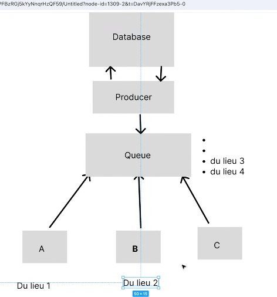

## Buổi 50
làm đăng kí, đăng nhập sai pass 3 lần khóa acc

làm:
- hdbank
- tma
- dxc

học 

https://developer.confluent.io/learn/kraft/
https://www.tutorialspoint.com/spring_boot/spring_boot_apache_kafka.htm
https://www.javaguides.net/2022/06/spring-boot-apache-kafka-tutorial.html

Chế Công Bình
https://www.cloudamqp.com/blog/part1-rabbitmq-for-beginners-what-is-rabbitmq.html

Giới thiệu về queue hàng đợi

1 quầy xử lý 1000 user bị quá tải, vậy nên giờ mình mở thêm 10 quầy mỗi quầy 100 user nó sẽ nhanh hơn.

mấy bạn gọi api, mỗi bạn 1000 api 

một api là 1 consumer 

hàng đợi giúp
- giảm số lượng time xử lý data bằng cách tăng consumer
- thứ 2 là bài toán chia data sao cho ko bị trùng bằng cách sử dụng queue



producer là nơi mình lấy cục source từ data base, xong đây lên 

zô cái link này
https://www.cloudamqp.com/blog/part1-rabbitmq-for-beginners-what-is-rabbitmq.html


- xong cái kalfa nó cũng y chang như thằng rabitmq
https://www.javaguides.net/2022/06/spring-boot-apache-kafka-tutorial.html?fbclid=IwY2xjawJsf95leHRuA2FlbQIxMAABHgF-eJGtPW7s9eei4zb_LpGb02gXmoslg6JUe1CTNQdi_ByUTpRnWRZTrvsH_aem_iSJDeBkF_VpMYmJ6lfEp3w
- nhưng tại sao người ta xài kafa

nó giống nhau ở cấu trúc nhưng khác nhau ở mặt hạ tầng

https://developer.confluent.io/learn/kraft/?fbclid=IwY2xjawJsgBdleHRuA2FlbQIxMAABHgF-eJGtPW7s9eei4zb_LpGb02gXmoslg6JUe1CTNQdi_ByUTpRnWRZTrvsH_aem_iSJDeBkF_VpMYmJ6lfEp3w

cái kafka ngon hơn rabitmq là setup hệ thống, chính là thằng clutter


zookeeper, mình có 4 con server nhưng 2 con ko còn ăn nên làm ra nữa, dẹp tịm. Trong khi đó 1 con server đang bị quá tải, 

topic của mình mình chỉ lưu đúng 1 data liên quan tới chiển khoản

producer nó bắt lưu zô cái kalka broker, 

```yml
  kafka:
    image: confluentinc/cp-kafka:latest
    hostname: kafka
    container_name: kafka
    ports:
      - "9092:9092"
      - "9093:9093"
      - "9094:9094"
    environment:
      KAFKA_KRAFT_MODE: "true"  # This enables KRaft mode in Kafka.
      KAFKA_PROCESS_ROLES: controller,broker  # Kafka acts as both broker and controller.
      KAFKA_NODE_ID: 1  # A unique ID for this Kafka instance.
      KAFKA_CONTROLLER_QUORUM_VOTERS: "1@kafka:9093"  # Defines the controller voters.
      KAFKA_LISTENERS: PLAINTEXT://kafka:9092,CONTROLLER://kafka:9093,EXTERNAL://kafka:9094  #internal
      KAFKA_LISTENER_SECURITY_PROTOCOL_MAP: PLAINTEXT:PLAINTEXT,CONTROLLER:PLAINTEXT,EXTERNAL:PLAINTEXT
      KAFKA_INTER_BROKER_LISTENER_NAME: PLAINTEXT
      KAFKA_CONTROLLER_LISTENER_NAMES: CONTROLLER
      KAFKA_ADVERTISED_LISTENERS: PLAINTEXT://kafka:9092,EXTERNAL://localhost:9094 # External
      KAFKA_LOG_DIRS: /var/lib/kafka/data  # Where Kafka stores its logs.
      KAFKA_AUTO_CREATE_TOPICS_ENABLE: "true"  # Kafka will automatically create topics if needed.
      KAFKA_OFFSETS_TOPIC_REPLICATION_FACTOR: 1  # Since we’re running one broker, one replica is enough.
      KAFKA_LOG_RETENTION_HOURS: 168  # Keep logs for 7 days.
      KAFKA_GROUP_INITIAL_REBALANCE_DELAY_MS: 0  # No delay for consumer rebalancing.
      CLUSTER_ID: "Mk3OEYBSD34fcwNTJENDM2Qk"  # A unique ID for the Kafka cluster.
    volumes:
      - /var/run/docker.sock:/var/run/docker.sock
      - ./data:/var/lib/kafka/data
    networks:
      - uniclub

  kafka-ui:
    image: provectuslabs/kafka-ui:latest
    container_name: kafka-ui-corporate
    ports:
      - "8085:8080"
    environment:
      KAFKA_CLUSTERS_0_NAME: local
      KAFKA_CLUSTERS_0_BOOTSTRAPSERVERS: kafka:9092
    networks:
      - uniclub
```


típ theo thêm cái network

```sh
docker compose up kafka -d
docker compose up kafka-ui -d
```

lên host http://localhost:8085/ thì nó hiển thị 1 cluster online


https://start.spring.io/

DependenciesAdd dependencies...Ctrl + b
- Spring Web Web
Build web, including RESTful, applications using Spring MVC. Uses Apache Tomcat as the default embedded container.
- Spring for Apache Kafka Messaging
Publish, subscribe, store, and process streams of records.


https://www.tutorialspoint.com/spring_boot/spring_boot_apache_kafka.htm?fbclid=IwZXh0bgNhZW0CMTEAAR6Dsw5mkrjUpdyhNdhuznFNSSX04wYNvv-pdhIKKyVArc0c_Is1-TIjp2IP3g_aem_tscsNMz8pQR-qtx8LEE2ww

start kafka trước xong mới start kafka ui