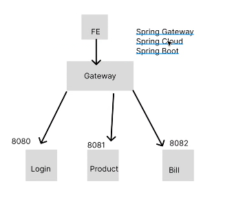
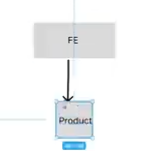
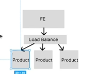
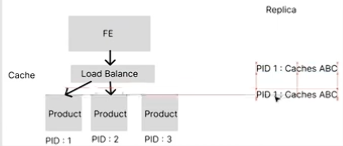
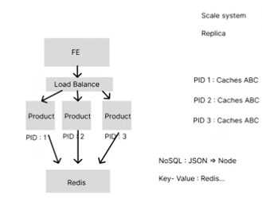
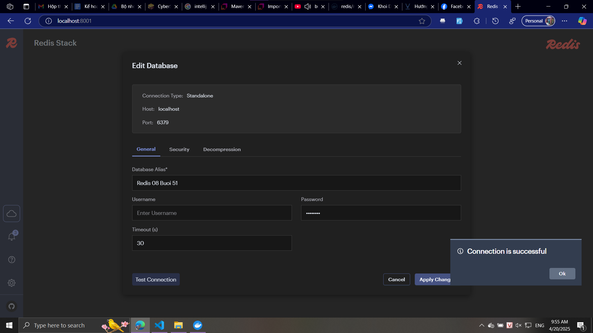
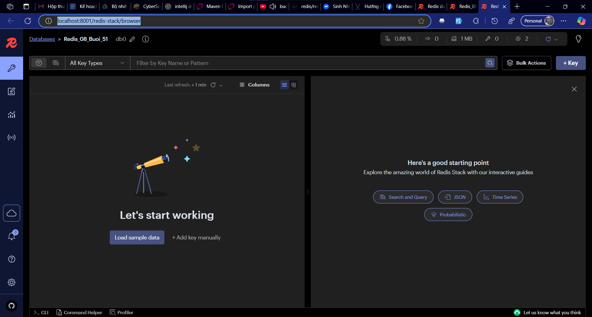

## buoi 51




[redis](https://hub.docker.com/r/redis/redis-stack?fbclid=IwZXh0bgNhZW0CMTEAAR45AfI4X4VNzmIAEY3waJYvAe8WVXRuE6I7wOQovwTLKE56gC9k7aVVkGsWHg_aem_K-b7ku8UMabIcnIuIXeYUg)

- load balancer
 - mình use ứng dụng thì mình ko chỉ cho 1 hay 50 người dùng mà có khi 5000 người use, thì front-end gọi api dễ bị sập, cái product dễ bị sập


 - bây giờ nó replica zô thành nhiều cục product
 - front-end gọi api lần thứ 1 zô cục source thứ nhất, gọi lần 2 zô cục thứ 2, gọi lần 3 zô cục thứ 3
 - mình chia tải cho nó đỡ bị tắt nghẽn




 - mình gọi cục source thứ 1, nó sẽ lưu cache trên cục source thứ nhất, gọi cục source thứ 2, nó lưu thêm cache ở cục source thứ hai, nó sẽ bị dư nhiều cache

- NoSQL: JSON
- Key - Value: Redis



- cái redis lưu dạng key value dễ lấy, giúp xử lý zụ cache ở các source replicate
- redis hỗ trợ set time hết hạn của data, lúc user đăng nhập 5 lần, đẩy lưu trữ lên redis của mình, có data thì user bị khóa
- khách hàng mún 3 dòng data 5h30 chạy, 
  - redis giúp lắng nghe data đã hết hạn, service đó sẽ kích hoạt
- xử lý zụ forgot pass, đặt pass mới ko giống 5 pass cũ, lưu trên redis, nếu pass đó có trên db rồi thì ko cho lưu pass trên đó nữa. Giúp giảm tải khối lượng data

- dùng link trên lấy
```sh
docker pull redis/redis-stack
```
docker compose up -d
anh Bình bảo nhóm Huyền và Hòa làm tốt 😆

[spring boot](https://viblo.asia/p/huong-dan-spring-boot-redis-aWj53NPGl6m?fbclid=IwZXh0bgNhZW0CMTEAAR7D81TGQNsgNiM9_1MMTy-OqN23SH-ccWvhLQdu6ykv4mNeUyEqHQ1HnF7ynQ_aem_ObMWl4M_vExnFWZQ3fTzQg)

zô link
[text](http://localhost:8001/)



http://localhost:8001/redis-stack/browser



https://mvnrepository.com/artifact/io.lettuce/lettuce-core

https://mvnrepository.com/artifact/io.lettuce/lettuce-core/6.5.5.RELEASE

buổi sau:
- gateway
- profile spring boot
- 