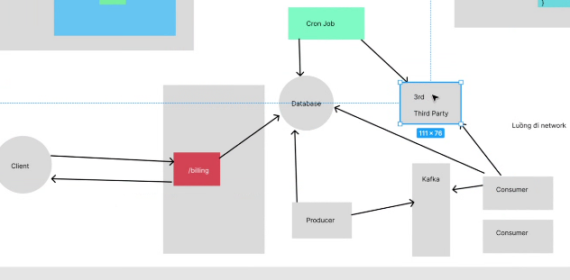
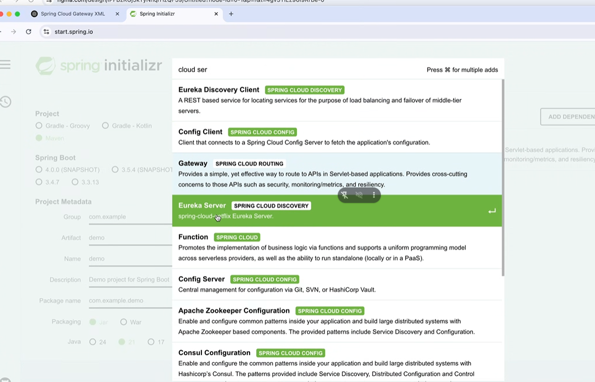
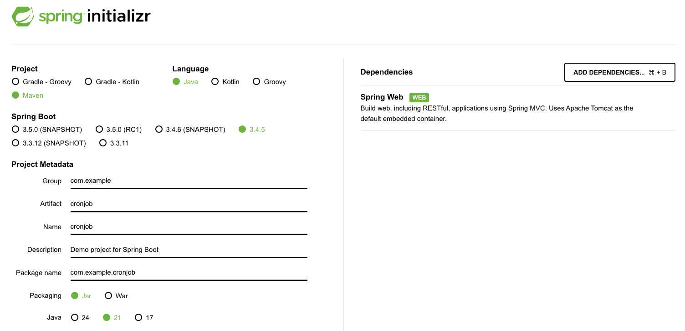

## buổi 52
- kafka sử dụng bất đồng bộ chứ ko phải đồng bộ, 

- con producer đảm nhận vai trò lấy data và sau đó đẩy lên kafka để lưu trữ

về cơ bản đi theo producer kafka thì nó quá nhiều source, phức tạp hóa vấn đề

khách hàng ko quan trọng phức tạp lâu mau, dùng ngay cronjob

mình đánh giá dựa trên tính năng này sau này có xài thường xuyên hay ko, nhiều người xài hay ko, 

nếu như 3rd cũng xài bất đồng bộ, thì xử lý ntn

hook, callback, delegate

anh Bình giải thích dấu sao, dấu hỏi, 

### đi làm quan tâm 2 vấn đề:
1. Lương
2. Bảo hiểm

## chiến lược deal lương

- kiếm cái slide rangle lương deal bao đúng
- cứ deal theo range lương đó là đúng

2 loại lương, lương net và lương gross:
net 12 cũng ngon
gross 

nếu được thì deal luôn gross luôn đi, gross chưa trừ thuế phí

deal net ko biết cty sẽ đóng bao nhiêu bao hiểm, thuế, phí, 

tháng 3 quyết toán thuế, thiếu thuế nộp thêm tiền mình phải bỏ chứ nó ko bỏ

nếu deal lương net 

có cái gì 

### về mặt bảo hiểm
- có 2 loại bhxh: đóng full lương cơ bản, full lương thực lãnh
- lương 25 chẹo ko 
- bhxh chính là lương hưu + bh thất nghiệp
- hỏi coi bhxh đóng ntn?

## chiến lược hack cv