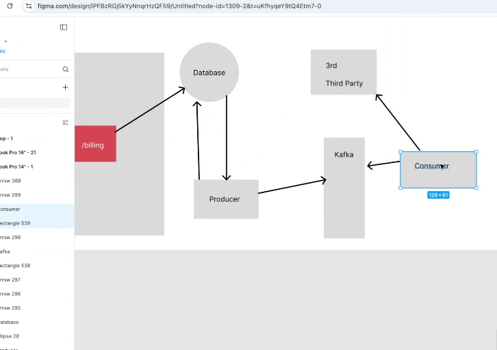
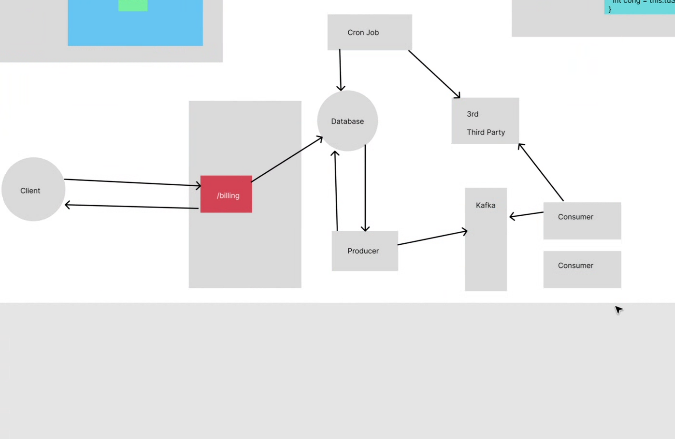

# Buổi 52

- CCU
- Tính năng nào được xài nhiều nhất
- tính năng nhiều băng thông nhất

bandwidth, băng thông ảnh hưởng tốc độ truy cập các thứ, mấy tính năng trả file up file thường tốn nhiều băng thông nhất

vậy nên có nên tách theo mô hình microservice, cái tính năng nào quan trọng user use nhiều, tách ra thành 1 cục, khi tách nhỏ ra thì chỉ scale đúng cục source này thôi, còn cục khác ko cần

thứ 2 là sizing

đây là lý do người ta tách service trên microservice

một trong những quan trọng nhất trong microservice là hình ảnh sơ đồ hệ thống like this

[text](https://www.geeksforgeeks.org/spring-cloud-gateway/?fbclid=IwZXh0bgNhZW0CMTEAAR5s-mVTcTZU_43WNwV84u5N_MGWg5uW6fHJUaNSJ6AU5nwUZwPxLbOgS-2Gaw_aem_fSPKffMAXDf8SuyKu5l-yw)

OAuth sau này xài công ty lớn là tự xây, ko chỉ là đăng nhập gg facebook

spring init
tạo cục login và cục product

mún lấy ds sản phẩm, 

cái gateway là xử lý logic redirect 

con gateway còn gọi là forwarder vì nó có nhiệm zụ điều hướng, nó ko xử lý logic code

chỉ đóng vai trò điều hướng thôi ko có tham số hay giá trị gì trả ra hết

còn có 1 nhu cầu nữa là con esb, vừa xử lý code vừa điều hướng lun

https://blogs.mulesoft.com/wp-content/uploads/2011/05/StudioScreenshotBeta.png

esb mulesoft

https://encrypted-tbn0.gstatic.com/images?q=tbn:ANd9GcTw_KIS8FSOmLfJDKwvgap-7Frkqfl3lgGfaQ&s

[text](https://www.geeksforgeeks.org/spring-cloud-gateway/?fbclid=IwZXh0bgNhZW0CMTEAAR5s-mVTcTZU_43WNwV84u5N_MGWg5uW6fHJUaNSJ6AU5nwUZwPxLbOgS-2Gaw_aem_fSPKffMAXDf8SuyKu5l-yw)

xài cái này tạo con gateway xong forward, làm sao biết mình đúng

đọc thử bài viết làm thử ra được ko

xài cái gateway này nè
